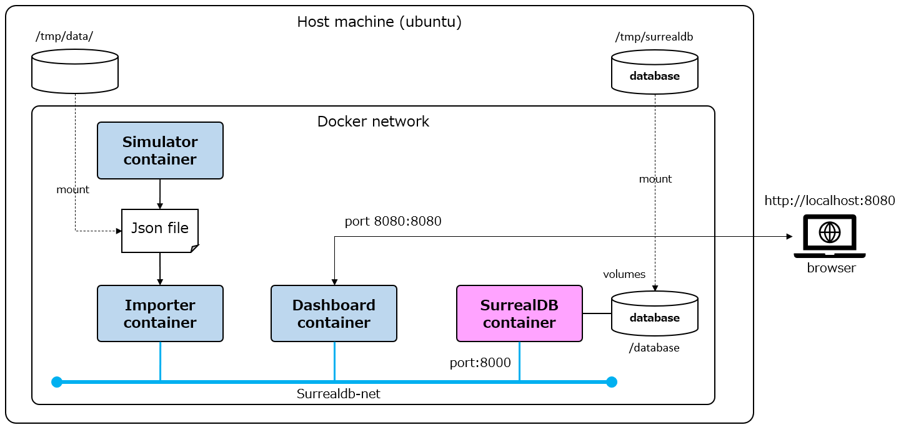
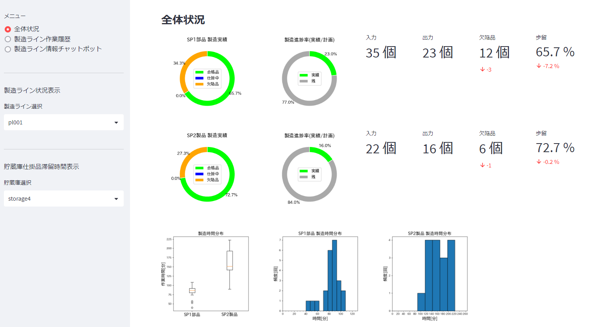
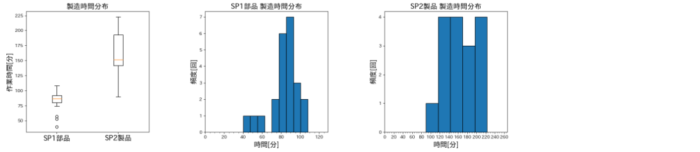
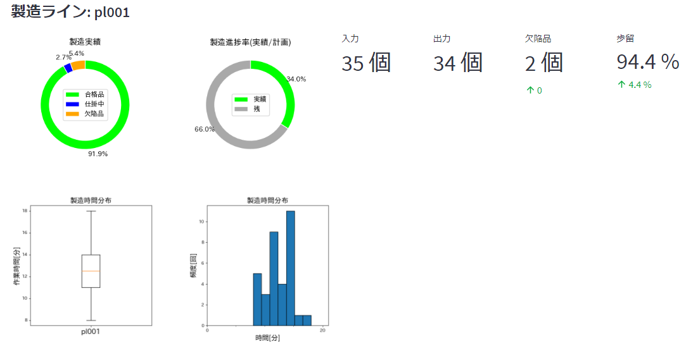
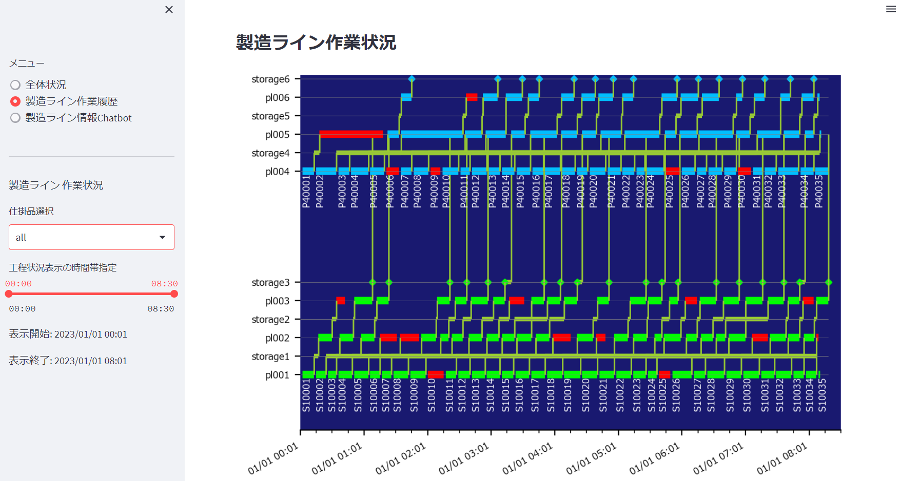
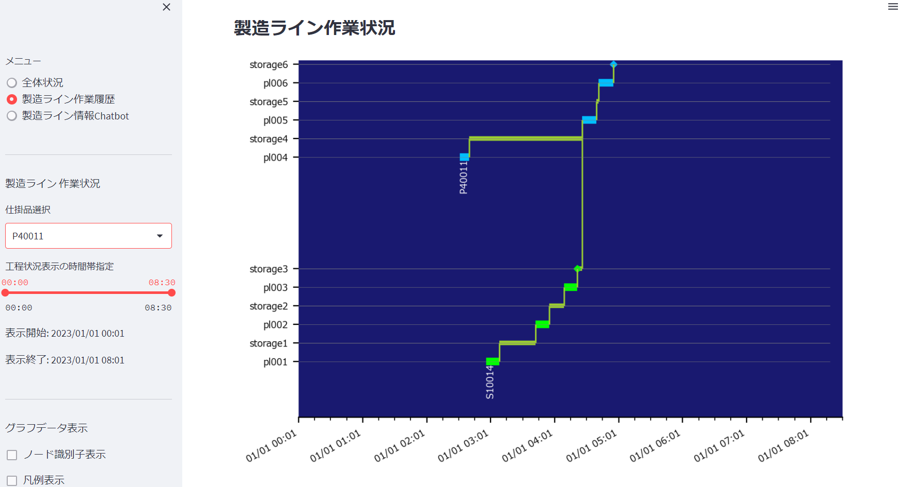

## Production line traceability system using the graph database SurrealDB
  
## Summary

This demo system uses the graph database SurrealDB to manage the traceability information of the production line.  
The demo system has the following features:  

1. 'Simulator' is a tool that simulates the production line and generates information generated on the production line.  
1. 'Importer' is a tool that imports the generated production line information into SurrealDB as graph data.
1. 'Dashboard' is a tool that displays the traceability information of the production line.
1. The 'Production Line Information Chatbot' is a tool that allows you to inquire and respond to traceability information on the production line in natural language (Japanese).  
  
For details of the process, please refer to '[Prototyping of Virtual production Line Traceability System Using Graph Database SurrealDB](./docs/README-blog.md)'.
  
## Demo system configuration  



* SurrealDB container  

    Graph database SurrealDB container  

* Simulater container  

    Simulate the production line that manufactures products and parts, and store the production information generated in the production process in a Json file.  

* Impoter container  

    Interpret the Json file generated by the Simulator and register the information to SurrealDB as graph data.  

* Dashboard container  

    Search SurrealDB and display the traceability information of the production line.  
    A chatbot that uses OpenAI GTP-4 to generate SurrealQL from Japanese natural language and search for production line information.  

---  

### Demo system operating environment

Works as a docker container on Windows10 WSL2 + ubuntu 20.04.  
It should work in an environment where Docker equivalent to ubuntu 20.04 works, but it has not been tested.
  
* Windows 10 version 22H2
* WSL version 1.2.0.0
* ubuntu version 20.04
* docker version 23.0.4, build 3e7cbfd  
* SurrealDB image [surrealdb/surrealdb:latest](https://hub.docker.com/r/surrealdb/surrealdb)
* factory-demo image factory-demo:latest  

---  

### Preparing the environment for the demo system

1. Get git repository

    ``` shell
    git clone  https://github.com/tmarumaru/manufacturing-line-dashboard-with-surrealdb.git
    ```

1. Create the Factory-demo image

    ``` shell
    make
    ```

1. Create a Docker network

    ``` shell
    docker network create surrealdb-net
    ```

1. Create a directory for storing Json file

    ``` shell
    sudo mkdir /tmp/data
    sudo chmod 777 /tmp/data
    ```

1. Create a directory for storing SurrealDB data.

    ``` shell
    sudo mkdir /tmp/surrealdb
    sudo chmod 777 /tmp/surrealdb
    ```

1. OpenAI API key information setting (optional)

    'Production Line Information Chatbot' uses OpenAI GTP-4 API.  
    The cost of using the OpenAI GPT-4 API in this chatpot is very high (due to the large number of tokens).  
    Therefore, we do not recommend using OpenAI GTP-4.  
  
    To use this function, obtain an OpenAI API key and define it in the .env file.  
    The .env file is stored in the project root directory.  
    Dashboard will work even if the .env file doesn't exist.  

* .env file format

    ``` shell
    OPENAI_KEY=sk-XXXXXXXXXXXXXXXXXXXXXXXXXXXXXXXXXXXXXXXXXXXXXXXX
    ```

---  

### Demo system start-up

1. Go to project root directory  

    ``` shell
    cd <Project-Root>
    ```

1. Start SurrealDB

    ``` shell
    $ ./ex_surrealdb.sh
    [+] Running 1/0
    [+] Running 1/1
    ✔ Container surrealdb  Started                                                                                    0.7s
    ```

1. Operation check of SurrealDB

    ``` shell
     $ ./ex_docker_status.sh
    CONTAINER ID   NAME       CPU %     MEM USAGE / LIMIT     MEM %     NET I/O           BLOCK I/O   PIDS
    70e275b54e56   surrealdb  0.00%     63.3MiB / 1.953GiB    3.17%     1.05kB / 0B       0B / 0B     5

    $ DATA="INFO FOR DB;"
    $ curl --request POST \
        --header "Accept: application/json" \
        --header "NS: test" \
        --header "DB: test" \
        --user "root:root" \
        --data "${DATA}" \
        http://localhost:8000/sql

    # Result
    [
        {
            "time":"132.1µs",
            "status":"OK",
            "result":
                {
                    "dl":{},
                    "dt":{},
                    "sc":{},
                    "tb":{}
                }
        }
    ]
    ```

1. Execute Simulator

    ``` shell
    $ ./ex_simulator.sh
    [+] Running 1/0
    ✔ Container simulator  Created                                                                                    0.0s
    Attaching to simulator
    simulator  | 製造ライン1, 製品仕様: SP01, 仕掛品識別子: PRODUCT:S10001, 製品型: PARTS
    simulator  | 製造ライン4, 製品仕様: SP02, 仕掛品識別子: PRODUCT:P40001, 製品型: PRODUCT
    simulator  | 製造ライン1, 製品仕様: SP01, 仕掛品識別子: PRODUCT:S10002, 製品型: PARTS
    simulator  | 製造ライン4, 製品仕様: SP02, 仕掛品識別子: PRODUCT:P40002, 製品型: PRODUCT
    ...
    simulator  | json file: /app/data/factory_data.json
    simulator exited with code 0
    ```

1. Execute Importer

    ``` shell
    $ ./ex_importer.sh
    [+] Running 1/1
    ✔ Container importer  Created                                                                                     0.1s
    Attaching to importer
    importer  | 2023-04-28T07:50:01.299688: started importing factory data into SurrealDB.
    importer  | 6 production lines were created.
    importer  | 7 storages were created.
    importer  | 12 machines were created.
    importer  | 6 operation crews were created.
    importer  | 4 raw materials were created.
    importer  | 70 products were created.
    importer  | 457 works were created.
    importer  | 164 Inspection results were created.
    importer  | 12 defect information were created.
    importer  | 2988 measurements information were created.
    importer  | 5100 relationships were created.
    importer  | 2023-04-28T07:50:41.042512: finished importing factory data into SurrealDB. elapsed time: 0:00:39.742824
    importer exited with code 0
    ```

1. Start Dashboard

    ``` shell
    $ ./ex_dashboard.sh
    [+] Running 1/1
    ✔ Container dashboard  Started   
    
    $ ./ex_docker_status.sh
    CONTAINER ID   NAME       CPU %     MEM USAGE / LIMIT     MEM %     NET I/O          BLOCK I/O   PIDS
    f278053522bd   dashboard  0.00%     118.1MiB / 1.953GiB   5.91%     1.79kB / 0B      0B / 0B     8
    70e275b54e56   surrealdb  0.00%     63.3MiB / 1.953GiB    3.17%     1.05kB / 0B      0B / 0B     5
    ```

1. Access dashboard from browser

    * url: <http://localhost:8080>
  
1. Stop Docker container

    Obtain the IDs of the SurrealDB and Dashboard containers, and stop the containers with the docker stop command.  

    ``` shell
    $ ./ex_docker_status.sh
    CONTAINER ID   NAME       CPU %     MEM USAGE / LIMIT     MEM %     NET I/O           BLOCK I/O   PIDS
    db0bb2a8d78f   dashboard  0.00%     126.7MiB / 1.953GiB   6.33%     1.83kB / 0B       0B / 0B     8 
    179c9e1fb27c   surrealdb  0.00%     67.66MiB / 1.953GiB   3.38%     16.4kB / 214kB    0B / 0B     5
    
    $ docker stop 179c9e1fb27c
    $ docker stop db0bb2a8d78f
    ```

---  

## Dashboard feature description

### Display the production status of all production lines
  
  
  
Displays the production results of SP1 parts and SP2 products.  
For SP1 parts, the production results for production lines pl001 to pl003 are displayed.  
For SP2 products, the production results for production lines pl004 to pl006 are displayed.  

  

* Production results (pie chart)
    The graph shows the number of work-in-progress items entering the final production line and the number of defects detected on the production line.  

* Production progress rate (pie chart)  
    Shows the number of production plans from the production management system and the ratio of acceptable products up to the present.  
    ※Because this is a demo system, production plan values ​​have no meaning.  

* Input: Total number of work-in-progress put into the production line  
  
* Output: Total number of work-in- products that passed final production line inspection  

* Defective: Total number of defective items detected on the production line  

* Yield rate = output ÷ (input + number of defective products)  
  
#### Total production time  

Displays the production time distribution of SP1 parts and SP2 products with box plots and histograms.  

    

#### Production status for each production line

Selecting a production line from the production line status display menu displays the production results and production time distribution of that production line.  

    

#### Dwell time of work-in-progress in storage

When you select a storage from the Storage WIP Dwell Time Display menu, it shows a boxplot and histogram of the WIP dwell time in the selected storage.  

    

---  

### Display the work history of the production lines

#### Display work history for all work-in-progress

The work history of the production line and the transfer history of storage for each work-in-progress is displayed in graphs.  

  

X-axis : Indicates elapsed time.  
Y-axis : Shows the production line and storage where work-in-progress moves from bottom to top.  

Green horizontal line   : Shows the working hours of each production line for parts (work-in-progress).  
Sky blue horizontal line: Shows the working time of each product (work-in-progress) on each production line.  
Gray horizontal line    : Shows the amount of time that parts or products (work-in-progress) remain in storage.  
Red horizontal line     : Indicates that a defect is detected in the work-in-progress in the corresponding production line.  
  
Defective work-in-progress are moved to repair storage, which is not shown in this graph.  

* The manufacturing process flow of the SP01 parts

    Production line pl001 ⇒ Storage1 ⇒ Production line pl002 ⇒ Storage2 ⇒ Production line pl003 ⇒ Storage3

* The manufacturing process flow of the SP02 product  

    Production line pl004 ⇒ Storage4 ⇒ Production line pl005 ⇒ Storage5 ⇒ Production line pl006 ⇒ Storage6
  
#### Display Work history for individual work-in-progress

You can display the work history of only the work-in-progress selected by 'Select work-in-progress' on the side menu.  
The figure below shows the work history of the product (work-in-progress) 'P40011'.

  

---  

#### Display Work-in-progress Work History and Transfer Work History

You can display the details of the work history and transfer work history of only the work-in-progress selected in the "Select work in progress" on the side menu.  
  
The figure below shows the details of the work history and transfer work history of the product (work-in-progress) "P40011".  
  
  
  
The figure below shows the details of the work history and transfer work history of the part (work-in-progress) "S10014" that will be incorporated into the product (P40011).  
  
  

---  

#### Display relevant graph data for products and parts

Nodes related to the work in progress selected in "Select work-in-progress" on the side menu are displayed as graph data.  
  
'P40011' Product, 'S10014' Parts and related nodes are displayed as flag data.
The nodes to be displayed are as follows.  

|Node|Description|  
|:-|:-|  
|Production line|pl001～pl006|  
|Storage|storage1～storage6|  
|Parts|Patrs|  
|Product|Product|  
|Defective Product|Defective product or parts|  
|Work|Manufacturing work|  
|Transfer work|Transfer work between production lines and storage|  
|Inspection resut|Inspection result of work|  
|Defect information|Defect information of WIP|  
|Raw material|Raw materials for work-in-progress|  
  
  

### Production line information chatbot
  
A chatbot that queries SurralDB production line information using Japanese natural language.  
Enter a query in Japanese in the "Inquiry" field and press the "Execute query" button to display the answer in the "Chat".  
  
Statements entered in the "Query" field are converted to SurrealQL using the OpenAI gpt-4 API.  
The generated SurrealQL is displayed in the "Generated SurrealQL" field.  
Query results from SurrealDB are converted to Japanese using the OpenAI gtp-4 API and displayed in the "chat" field.  
  
  


#### Query example  

* Query  

    ```  text
    欠陥情報を持つ製品ＩＤを取得しろ
    ```

* Generated SurrealQL

    ``` sql
    SELECT <-HAS_DEFECT<-PRODUCT.id AS product_id FROM DEFECT_INFORMATION SPLIT product_id ;
    ```

* Answer  

    ``` text
    欠陥情報を持つ製品IDは、PRODUCT:S10010、PRODUCT:S10025、PRODUCT:S10004、PRODUCT:S10005、PRODUCT:S10015、PRODUCT:S10017、
                          PRODUCT:S10027、PRODUCT:S10031、PRODUCT:S10001、PRODUCT:S10011、PRODUCT:S10021、PRODUCT:S10029、
                          PRODUCT:P40006、PRODUCT:P40009、PRODUCT:P40025、PRODUCT:P40030、PRODUCT:P40001、PRODUCT:P40003です。
    ```

* Query  

    ```  text
    製品ＩＤ＝PRODUCT:S10004の欠陥を検出した作業ＩＤと、作業開始時間、作業終了時間を取得しろ
    ```

* Generated SurrealQL

    ``` sql
    SELECT id AS work_id, 
           <-STARTED_BY.data.timestamp AS started_at, 
           <-ENDED_BY.data.timestamp AS ended_at 
    FROM WORK 
    WHERE <-STARTED_BY<-(PRODUCT WHERE id = 'PRODUCT:S10004') 
          AND ->RECORDS->DEFECT_INFORMATION<-HAS_DEFECT<-PRODUCT  
    SPLIT work_id FETCH started_at, ended_at ;
    ```

* Answer  

    ``` text
    作業ID：WORK:wpl00200039、作業開始時間：2023年1月1日 1時15分、作業終了時間：2023年1月1日 1時31分
    ```

* Query  

    ```  text
    作業ＩＤ = "WORK:wpl00200039"が実行された製造ラインＩＤを取得しろ
    ```

* Generated SurrealQL

    ``` sql
    SELECT id AS production_line_id 
    FROM PRODUCTION_LINE 
    WHERE ->EXECUTES->(WORK WHERE id = 'WORK:wpl00200039') ;
    ```

* Answer  

    ``` text
    作業ID「WORK:wpl00200039」は製造ラインID「PRODUCTION_LINE:pl002」で実行されたものです。
    ```
  
---  

## Development environment

* OS: Windows10
* pyhton 3.11
* IDE pycharm  2022.3.1

Developed with Windows 10 Pycharm.  
Development is possible with other IDEs (VS Code, etc.).  
Please refer to the information of each IDE for how to set the project in the IDE.  

### Project configuration
  
The directory structure of the project is shown below.  

``` text
root
├── main                     source code directory
├── docs                     documents
├── json_data                Directory where Json data files of simulation results are stored
└── tests                    Directory for testprograms
```
  
The Pycharm project configuration is specified as follows.  
  
* Sources directory : ProjectRoot/main
* Tests directory : ProjectRoot/tests
  
### Project file structure

``` text
root
├── LICENSE
├── Dockerfile                                          # for facotry-demo image
├── Makefile                                            # for creating docker image
├── README.md                                           # this file
├── common.sh                                           # Common information definition shell
├── docker-compose-dashboard.yml                        # docker-compose config file to launch the dashboard
├── docker-compose-importer.yml                         # docker-compose config file to launch the importer
├── docker-compose-simulator.yml                        # docker-compose config file to launch the simulator
├── docker-compose-surrealdb-file.yml                   # docker-compose config file to launch SurrealDB(files)
├── docker-compose-surrealdb.yml                        # docker-compose config file to launch SurrealDB(in-memory)
├── docker-compose-ubuntu.yml                           # docker-compose config file to launch Ubuntu (for debugging)
├── ex_dashboard.sh                                     # Dashboard launch shell
├── ex_importer.sh                                      # Importer launch shell
├── ex_simulator.sh                                     # Simulator launch shell
├── ex_surrealdb.sh                                     # SurrealDB launch shell
├── ex_docker_statue.sh                                 # Dcoker container information output shell
├── docs                                                # Documents
├── json_data                                           # 
│   └── factory_data.json                               # Sample json data file of simulation results
├── main                                                # 
│   ├── arguments_parser.py                             # Argument parsing
│   ├── dashboard                                       # Dashboard
│   │   ├── dashboard_main.py                           # Dashboard main
│   │   ├── factory_session_state_cache.py              # production information cache control
│   │   ├── graphic_data                                # graphic processing(matplotlib)
│   │   │   ├── graph_element_builder.py                # Graphic element builder
│   │   │   └── graph_elements.py                       # Graphic element definition
│   │   ├── page1                                       # 
│   │   │   └── factory_dashboard.py                    # Display the production status of all production lines
│   │   ├── page2                                       # 
│   │   │   ├── product_operation_view.py               # production graph data view component
│   │   │   ├── production_line_data_cache.py           # production line data cache control
│   │   │   ├── production_lines_status_view.py         # production line status view component
│   │   │   └── production_work_history_dashboard.py    # product work hisotry viewer
│   │   └── page3                                       # 
│   │       ├── factory_chatbot.py                      # factory chatbot
│   │       └── prompt.py                               # prompt for chatgpt-4
│   ├── helper                                          # 
│   │   ├── db_helper.py                                # SurrealDB Client wrapper
│   │   ├── factory_db_helper.py                        # factory data manipulation helper
│   │   └── surrealdb_sql_def.py                        # SurrealQL definition
│   ├── importer                                        # 
│   │   ├── factory_data_import_manager.py              # importe manager
│   │   └── factory_data_reader.py                      # json file reader
│   ├── main.py                                         # simulator/importer 起動起点
│   ├── run_server.py                                   # IDEからのDashboard起動起点
│   ├── simulator                                       # 
│   │   ├── factory_model_builder.py                    # factory models builder
│   │   ├── factory_models.py                           # factory model definition
│   │   ├── factory_simulator.py                        # factory simulator
│   │   ├── process                                     # 
│   │   │   ├── assembly_process.py                     # simulator process
│   │   │   ├── awork_manager.py                        # simulator process
│   │   │   ├── inspection_process.py                   # simulator process
│   │   │   ├── intermediate_process.py                 # simulator process
│   │   │   ├── machine_process.py                      # simulator process
│   │   │   ├── production_history_manager.py           # production work hisotry manager
│   │   │   ├── storage_resource.py                     # simulator process
│   │   │   └── wip_creation_process.py                 # simulator process
│   │   └── simulator_manager.py                        # simulator manager
│   └── util.py
├── requirements.txt                                    # 
└── tests
```

### Technology used

|technology|version|note|  
|:-|:-|:-|  
|python|3.11.0||  
|SurrealDB|v1.0.0-beta.9|[site](https://github.com/surrealdb/surrealdb)|  
|simpy|1.12|[site](https://simpy.readthedocs.io/en/latest/index.html)|  
|streamlit|1.22.0|[site](https://streamlit.io/)|  
|streamlit-chat|0.0.2.2|[site](https://pypi.org/project/streamlit-chat/)|  
|matplotlib|3.7.1|[site](https://matplotlib.org/stable/api/_as_gen/matplotlib.axes.Axes.pie.html)|  
|pyecharts|2.0.2|[site](https://pyecharts.org/#/)|  
|openai|0.27.2|[site](https://openai.com/blog/openai-api)|  
|langchain|0.0.123|[site](https://python.langchain.com/en/latest/index.html)|  

### License

* MIT License
