## グラフデータベースSurrealDBによる製造ラインのトレーサビリティシステム
  
## 概要

グラフデータベース SurrealDBを使用して製造ラインのトレーサビリティ情報を管理するデモシステムです.  
デモシステムには、以下の機能があります  

1. "Simulator"は製造ラインをシミュレートし製造ラインで発生する情報を生成するツールです.  
1. "Importer"は生成された製造ライン情報をSurrealDBへグラフデータとしてインポートするツールです.  
1. "Dashboard"は、製造ラインのトレーサビリティ情報を表示するツールです.  
1. "製造ライン情報チャットボット"は、自然言語（日本語）で製造ラインのトレーサビリティ情報を問い合わせ・回答することができるツールです.  

処理の詳細は「[グラフデータベースSurrealDBによる仮想製造ラインのトレーサビリティシステムの試作](./docs/README-blog.md)」を参照してください.  
  
## デモシステム構成  

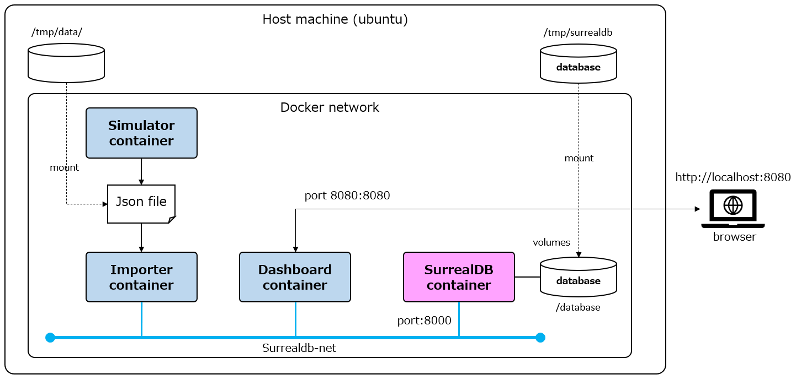

* SurrealDB container  

    グラフデータベース SurraleDB.  

* Simulater container  

    製品および部品を製造する製造ラインをシミュレーションし、製造過程で発生する製造情報をJsonファイルへ格納する.  

* Impoter container  

    Simulatorが生成したJsonファイルを解釈し、その情報をグラフデータとしてSurrealDBへ登録する.  

* Dashboard container  

    SurrealDBを検索し製造ラインのトレーサビリティ情報を表示する.  
    OpenAI GTP-4を使用し日本語自然言語からSurrealQLを生成し製造ライン情報を検索するチャットボット.  

---  

### デモシステム動作環境

Windows10 WSL2 + ubuntu 20.04 上でdocker containerとして動作します.  
WSL2 + ubuntu 20.04 と同等のDockerが動作する環境であれば動作可能であると思いますが動作確認はしていません.  
  
* Windows 10 version 22H2
* WSL version 1.2.0.0
* ubuntu version 20.04
* docker version 23.0.4, build 3e7cbfd  
* SurrealDB image [surrealdb/surrealdb:latest](https://hub.docker.com/r/surrealdb/surrealdb)
* factory-demo image factory-demo:latest

---  

### デモシステムの環境準備

1. git リポジトリ取得

    任意のディレクトリへリポジトリを格納する.  

    ``` shell
    git clone  https://github.com/tmarumaru/manufacturing-line-dashboard-with-surrealdb.git
    ```

1. docker image 作成

    ``` shell
    make
    ```

1. ネットワーク作成  

    ``` shell
    docker network create surrealdb-net
    ```

1. Json file 格納用ディレクトリ作成

    ``` shell
    sudo mkdir /tmp/data
    sudo chmod 777 /tmp/data
    ```

1. SurrealDB データ格納ディレクトリ作成

    ``` shell
    sudo mkdir /tmp/surrealdb
    sudo chmod 777 /tmp/surrealdb
    ```

1. .OpenAI APIキー情報設定(任意)  

    "製造ライン情報チャットボット"では、OpenAI GTP-4 のAPIを使用しています.  
    本チャットポットでのOpenAI GPT-4 API使用コストは非常に高くなります. (token数が多量になるため)  
    ですので、OpenAI GTP-4の利用はあまり推奨しません.  

    この機能を使用する場合は、OpenAI のAPIキーを取得し.envファイルへ定義します.  
    .envファイルはプロジェクトルートディレクトリへ格納します.  
    .envファイルが存在しなくても、Dashboardは動作します.  

    .env ファイル形式

    ``` shell
    OPENAI_KEY=sk-XXXXXXXXXXXXXXXXXXXXXXXXXXXXXXXXXXXXXXXXXXXXXXXX
    ```

---  

### デモシステムの起動手順

1. プロジェクトルート ディレクトリへ移動  

    ``` shell
    cd <Project-Root>
    ```

1. SurrealDB起動

    ``` shell
    $ ./ex_surrealdb.sh
    [+] Running 1/0
    [+] Running 1/1
    ✔ Container surrealdb  Started                                                                                    0.7s
    ```

1. SurrealDB動作確認

    ``` shell
     $ ./ex_docker_status.sh
    CONTAINER ID   NAME       CPU %     MEM USAGE / LIMIT     MEM %     NET I/O           BLOCK I/O   PIDS
    70e275b54e56   surrealdb  0.00%     63.3MiB / 1.953GiB    3.17%     1.05kB / 0B       0B / 0B     5

    $ DATA="INFO FOR DB;"
    $ curl --request POST \
        --header "Accept: application/json" \
        --header "NS: test" \
        --header "DB: test" \
        --user "root:root" \
        --data "${DATA}" \
        http://localhost:8000/sql

    # 結果
    [
        {
            "time":"132.1µs",
            "status":"OK",
            "result":
                {
                    "dl":{},
                    "dt":{},
                    "sc":{},
                    "tb":{}
                }
        }
    ]
    ```

1. Simulator起動

    ``` shell
    $ ./ex_simulator.sh
    [+] Running 1/0
    ✔ Container simulator  Created                                                                                    0.0s
    Attaching to simulator
    simulator  | 製造ライン1, 製品仕様: SP01, 仕掛品識別子: PRODUCT:S10001, 製品型: PARTS
    simulator  | 製造ライン4, 製品仕様: SP02, 仕掛品識別子: PRODUCT:P40001, 製品型: PRODUCT
    simulator  | 製造ライン1, 製品仕様: SP01, 仕掛品識別子: PRODUCT:S10002, 製品型: PARTS
    simulator  | 製造ライン4, 製品仕様: SP02, 仕掛品識別子: PRODUCT:P40002, 製品型: PRODUCT
    ...
    simulator  | json file: /app/data/factory_data.json
    simulator exited with code 0
    ```

1. Importer起動

    ``` shell
    $ ./ex_importer.sh
    [+] Running 1/1
    ✔ Container importer  Created                                                                                     0.1s
    Attaching to importer
    importer  | 2023-04-28T07:50:01.299688: started importing factory data into SurrealDB.
    importer  | 6 production lines were created.
    importer  | 7 storages were created.
    importer  | 12 machines were created.
    importer  | 6 operation crews were created.
    importer  | 4 raw materials were created.
    importer  | 70 products were created.
    importer  | 457 works were created.
    importer  | 164 Inspection results were created.
    importer  | 12 defect information were created.
    importer  | 2988 measurements information were created.
    importer  | 5100 relationships were created.
    importer  | 2023-04-28T07:50:41.042512: finished importing factory data into SurrealDB. elapsed time: 0:00:39.742824
    importer exited with code 0
    ```

1. Dashboard起動と確認

    ``` shell
    $ ./ex_dashboard.sh
    [+] Running 1/1
    ✔ Container dashboard  Started   
    
    $ ./ex_docker_status.sh
    CONTAINER ID   NAME       CPU %     MEM USAGE / LIMIT     MEM %     NET I/O          BLOCK I/O   PIDS
    f278053522bd   dashboard  0.00%     118.1MiB / 1.953GiB   5.91%     1.79kB / 0B      0B / 0B     8
    70e275b54e56   surrealdb  0.00%     63.3MiB / 1.953GiB    3.17%     1.05kB / 0B      0B / 0B     5
    ```

1. ブラウザからDashboardをアクセスする  

    * url: <http://localhost:8080>
  

1. Docker containerの停止

    SurrealDBとDashboardのcontainerのIDを求め、docker stop コマンドでcontainerを停止してください.  

    ``` shell
    $ ./ex_docker_status.sh
    CONTAINER ID   NAME       CPU %     MEM USAGE / LIMIT     MEM %     NET I/O           BLOCK I/O   PIDS
    db0bb2a8d78f   dashboard  0.00%     126.7MiB / 1.953GiB   6.33%     1.83kB / 0B       0B / 0B     8 
    179c9e1fb27c   surrealdb  0.00%     67.66MiB / 1.953GiB   3.38%     16.4kB / 214kB    0B / 0B     5
    
    $ docker stop 179c9e1fb27c
    $ docker stop db0bb2a8d78f
    ```

---  

## ダッシュボード画面仕様  

### 全体状況画面
  
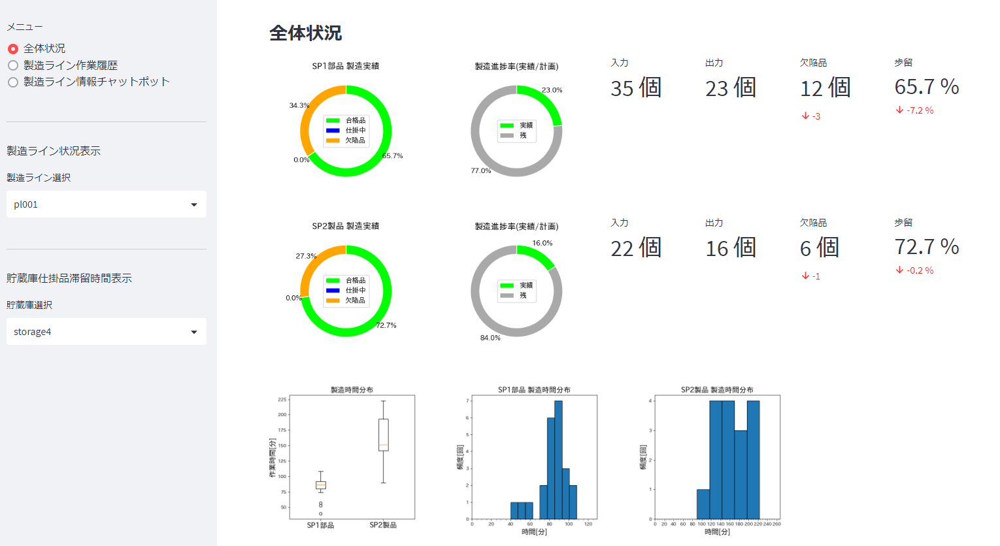  
  
ＳＰ１部品およびＳＰ２製品の製造実績を表示します.  
ＳＰ１部品は、製造ラインpl001～pl003 までの製造実績を表示します.  
ＳＰ２製品は、製造ラインpl004～pl006 までの製造実績を表示します.  

  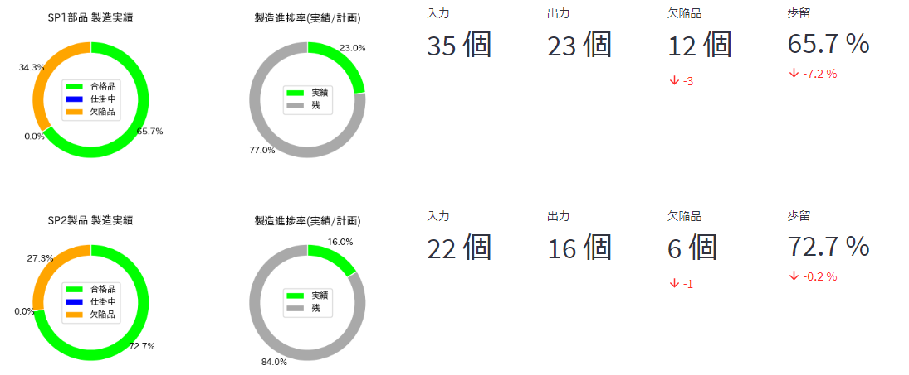

* 製造実績(円グラフ)  
    最終製造ラインに入った仕掛品数と、製造ラインで検出された欠陥数をグラフ表示している.

* 製造進捗率(円グラフ)
    生産管理システム等からの生産計画数と現在までの合格品の割合を表示している.  
    ※デモシステムのため、生産計画値には意味がない.  

* 入力 :  製造ラインへ投入された仕掛品総数  

* 出力 : 最終製造ラインの検査で合格した仕掛品総数  

* 欠陥品 : 製造ラインで検出された欠陥品の総数  

* 歩留率 ＝ 出力 ÷ (入力 ＋ 欠陥品数)  

#### 全体製造時間  

ＳＰ１部品およびＳＰ２製品の製造時間分布を、箱ひげ図とヒストグラムで表示します.  

  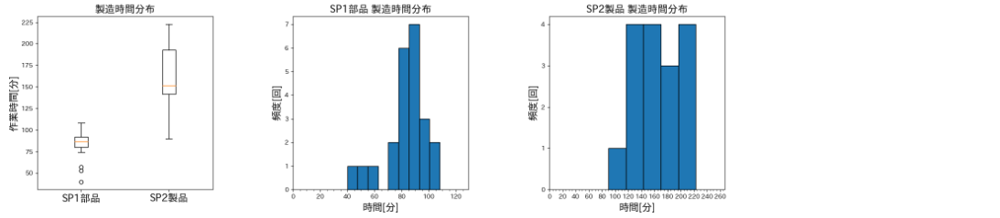  

#### 製造ライン毎の製造状況  

製造ライン状況表示メニューで製造ラインを選択すると、その製造ラインの製造実績と製造時間分布を表示します.  
グラフと表示数値の意味は全体状況と全体製造時間と同じです.  

  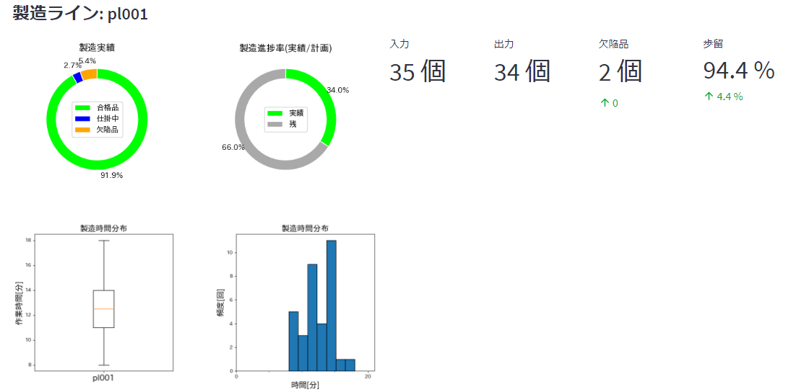  

#### 貯蔵庫仕掛品滞留時間

貯蔵庫仕掛品滞留時間表示メニューで貯蔵庫を選択すると、その貯蔵庫の仕掛品の滞留時間分布を箱ひげ図とヒストグラムを表示します.  

  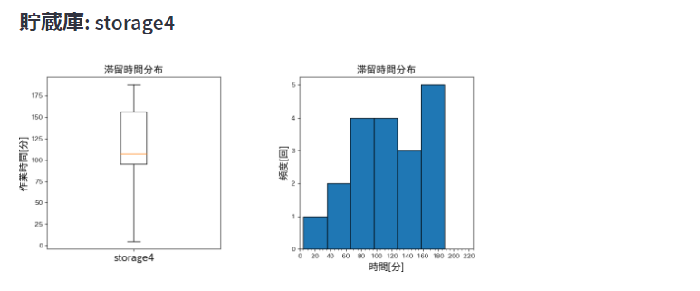  

---  

### 製造ライン作業履歴画面

#### 全仕掛品作業履歴  

仕掛品毎の製造ラインの作業履歴、貯蔵庫移動履歴をグラフで表示します.  

  

Ｘ軸 : 経過時間を示します.  
Ｙ軸 : 下から上へ方向に仕掛品の移動する製造ラインと貯蔵庫を示します.  
  
緑色水平線 : 部品(仕掛品)の各製造ラインでの作業時間を示します.  
空色水平線 : 製品(仕掛品)の各製造ラインでの作業時間を示します.  
鶯色水平線 : 部品または製品(仕掛品)が貯蔵庫に滞留している時間を示します.  
赤色水平線 : 該当製造ラインで仕掛品に欠陥が検出されことを示します.  
  
欠陥品は修理用貯蔵庫へ移動されますが、このグラフでは表示していません.  

* SP01部品(仕掛品)の製造工程の流れ  
  
    製造ラインpl001 ⇒ 貯蔵庫storage1 ⇒ 製造ラインpl002 ⇒ 貯蔵庫storage2 ⇒ 製造ラインpl003 ⇒ 貯蔵庫storage  

* SP02製品(仕掛品)の製造工程の流れ  
  
    製造ラインpl004 ⇒ 貯蔵庫storage4 ⇒ 製造ラインpl005 ⇒ 貯蔵庫storage5 ⇒ 製造ラインpl006 ⇒ 貯蔵庫storage6  

  
#### 個別仕掛品の作業履歴表示  

サイドメニューの「仕掛品選択」で選択した仕掛品だけの作業履歴を表示できます.
下図は製品(仕掛品) "P40011" の作業履歴です.  

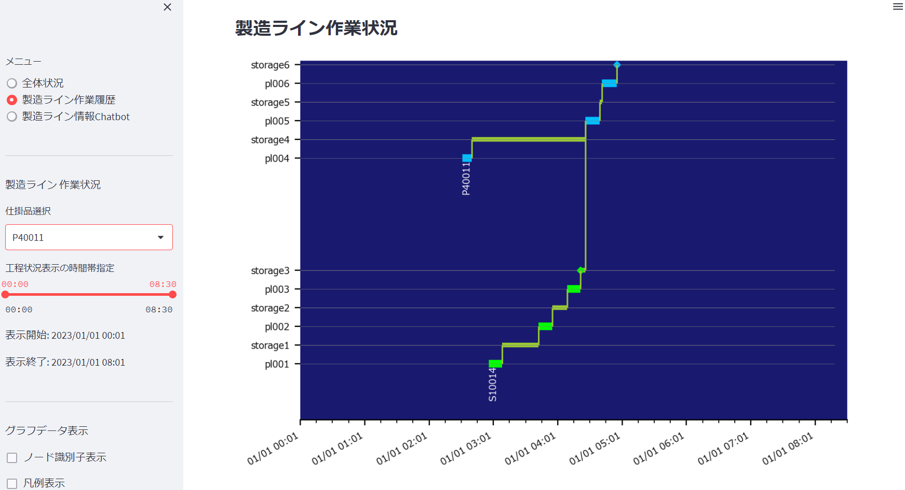  

---  

#### 仕掛品作業履歴、移動作業履歴  

サイドメニューの「仕掛品選択」で選択した仕掛品だけの作業履歴、移動作業履歴の詳細を表示されます.
  
下図は製品(仕掛品) "P40011" の作業履歴、移動作業履歴の詳細です.  
  
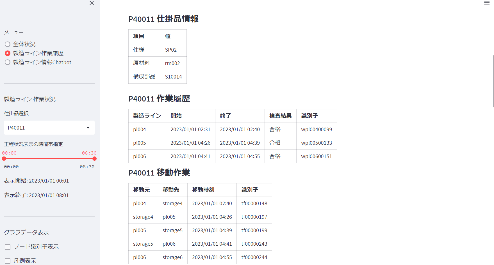  
  
下図は製品(P40011)へ組込まれる部品(仕掛品) "S10014" の作業履歴、移動作業履歴の詳細です.  
  
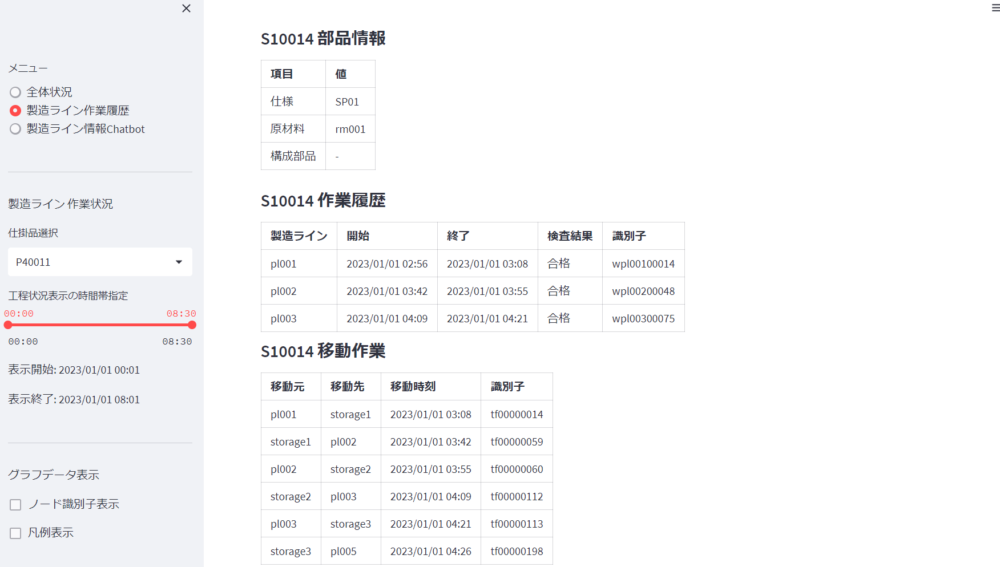  

---  

#### 製品と部品の作業関連グラフデータ表示  

サイドメニューの「仕掛品選択」で選択した仕掛品と関連するノードがグラフデータで表示されます.
  
"P40011" 製品と "S10014" 部品の作業と関連項目がフラグデータで表示されます.  
表示するノードは以下です.  

|ノード名|説明|補足|  
|:-|:-|:-|  
|製造ライン|pl001～pl006||  
|貯蔵庫|storage1～storage6||  
|製品|製品||  
|部品|部品||  
|欠陥品|欠陥が検知された製品または部品||  
|作業|製造ラインの作業||  
|移動作業|製造ライン、貯蔵庫間の移動作業||  
|検査結果|作業の検査結果||  
|欠陥情報|仕掛品の欠陥情報||  
|原材料|仕掛品の原材料||  
  
  
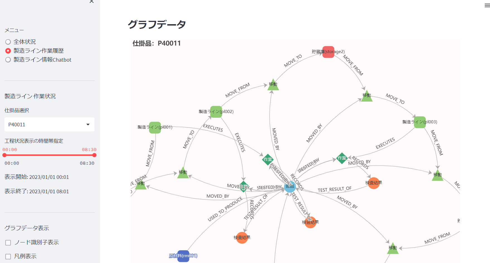  


### 製造ライン情報チャットボット
  
日本語自然言語を使ってSurralDBの製造ライン情報を問合せするチャットボットです.  
「問合せ」フィールドへ日本語で問合せ文を入力して「問合せ実行」ボンタを押下と「チャット」へ回答を表示します.  
  
「問合せ」フィールドへ入力された文は OpenAI gpt-4 API を使用してSurrealQLへ変換されます.  
生成されたSurrealQLは「生成されたSurrealQL」フィールドへ表示されます.  
SurrealDBからの問合せ結果は OpenAI gtp-4 APIを使用して日本語へ変換され「チャット」フィールドへ表示されます.  
  
  
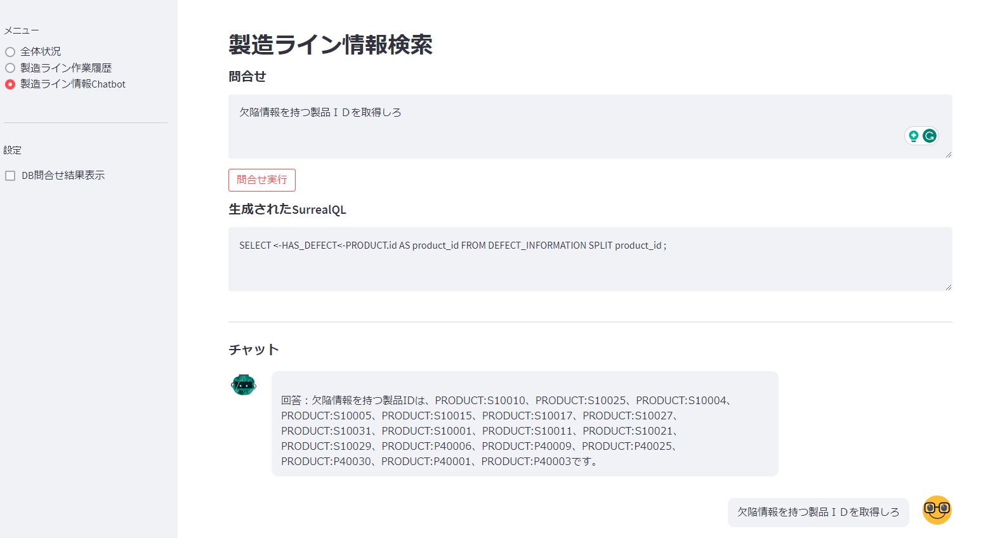  


#### 問合せ例  

* 問合せ  

    ```  text
    欠陥情報を持つ製品ＩＤを取得しろ
    ```

* 生成されたSurrealQL

    ``` sql
    SELECT <-HAS_DEFECT<-PRODUCT.id AS product_id FROM DEFECT_INFORMATION SPLIT product_id ;
    ```

* 回答  

    ``` text
    欠陥情報を持つ製品IDは、PRODUCT:S10010、PRODUCT:S10025、PRODUCT:S10004、PRODUCT:S10005、PRODUCT:S10015、PRODUCT:S10017、
                          PRODUCT:S10027、PRODUCT:S10031、PRODUCT:S10001、PRODUCT:S10011、PRODUCT:S10021、PRODUCT:S10029、
                          PRODUCT:P40006、PRODUCT:P40009、PRODUCT:P40025、PRODUCT:P40030、PRODUCT:P40001、PRODUCT:P40003です。
    ```

* 問合せ  

    ```  text
    製品ＩＤ＝PRODUCT:S10004の欠陥を検出した作業ＩＤと、作業開始時間、作業終了時間を取得しろ
    ```

* 生成されたSurrealQL

    ``` sql
    SELECT id AS work_id, 
           <-STARTED_BY.data.timestamp AS started_at, 
           <-ENDED_BY.data.timestamp AS ended_at 
    FROM WORK 
    WHERE <-STARTED_BY<-(PRODUCT WHERE id = 'PRODUCT:S10004') 
          AND ->RECORDS->DEFECT_INFORMATION<-HAS_DEFECT<-PRODUCT  
    SPLIT work_id FETCH started_at, ended_at ;
    ```

* 回答  

    ``` text
    作業ID：WORK:wpl00200039、作業開始時間：2023年1月1日 1時15分、作業終了時間：2023年1月1日 1時31分
    ```

* 問合せ  

    ```  text
    作業ＩＤ = "WORK:wpl00200039"が実行された製造ラインＩＤを取得しろ
    ```

* 生成されたSurrealQL

    ``` sql
    SELECT id AS production_line_id 
    FROM PRODUCTION_LINE 
    WHERE ->EXECUTES->(WORK WHERE id = 'WORK:wpl00200039') ;
    ```

* 回答  

    ``` text
    作業ID「WORK:wpl00200039」は製造ラインID「PRODUCTION_LINE:pl002」で実行されたものです。
    ```
  
---  

## 開発環境

* OS: Windows10
* pyhton 3.11
* IDE pycharm  2022.3.1

Windows10 Pycharm で開発しています.  
他のIDE (VS Code等)でも開発は可能です.  
IDEでのプロジェクトの設定方法は各IDEの情報を参考にしてください.  

### プロジェクト構成  

プロジェクトのディレクトリ構成を以下に示します.  

``` text
root
├── main                     ソースコード ディレクトリ
├── docs                     ドキュメント群
├── json_data                シミュレーション結果 Jsonデータファイル
└── tests                    テストプログラム用ディレクトリ
```

Pycharmのプロジェクト構成は以下のように指定します.  

* Sourcesディレクトリ : ProjectRoot/main
* Testsディレクトリ  : ProjectRoot/tests

### プロジェクトファイル構成

``` text
root
├── LICENSE
├── Dockerfile                                          # facotry-demo image
├── Makefile                                            # docker image作成 Makefile 
├── README.md                                           # このファイル
├── common.sh                                           # 共通情報定義シェル
├── docker-compose-dashboard.yml                        # ダッシュボード起動 docker-compose定義
├── docker-compose-importer.yml                         # インポータ起動 docker-compose定義
├── docker-compose-simulator.yml                        # シミュレータ起動 docker-compose定義
├── docker-compose-surrealdb-file.yml                   # SurrealDB起動 docker-compose定義(ファイル使用)
├── docker-compose-surrealdb.yml                        # SurrealDB起動 docker-compose定義(in-memory)
├── docker-compose-ubuntu.yml                           # Ubuntu起動  (デバッグ用)
├── ex_dashboard.sh                                     # ダッシュボード起動シェル
├── ex_importer.sh                                      # インポータ起動シェル
├── ex_simulator.sh                                     # シミュレータ起動シェル
├── ex_surrealdb.sh                                     # SurrealDB起動シェル
├── ex_docker_statue.sh                                 # Dcoker container 情報出力シェル
├── docs                                                # ドキュメント群
├── json_data                                           # 
│   └── factory_data.json                               # サンプル シミュレーション結果ファイル(製造情報データ)
├── main                                                # ソースコード ディレクトリ
│   ├── arguments_parser.py                             # 引数解釈
│   ├── dashboard                                       # ダッシュボード
│   │   ├── dashboard_main.py                           # ダッシュボード主処理
│   │   ├── factory_session_state_cache.py              # 製造情報キャッシュ制御
│   │   ├── graphic_data                                # matplotlib図形処理
│   │   │   ├── graph_element_builder.py                # 図形要素ビルダ
│   │   │   └── graph_elements.py                       # 図形要素定義
│   │   ├── page1                                       # 
│   │   │   └── factory_dashboard.py                    # 全体状況画面
│   │   ├── page2                                       # 
│   │   │   ├── product_operation_view.py               # 製造ライン情報 グラフデータ表示処理
│   │   │   ├── production_line_data_cache.py           # 製造ライン情報キャッシュ処理
│   │   │   ├── production_lines_status_view.py         # 製品の作業履歴情報表示
│   │   │   └── production_work_history_dashboard.py    # 製造ライン作業履歴画面
│   │   └── page3                                       # 
│   │       ├── factory_chatbot.py                      # 製造ライン情報チャットボット画面
│   │       └── prompt.py                               # GPT-3.5/GPT-4用プロンプト定義
│   ├── helper                                          # 
│   │   ├── db_helper.py                                # SurrealDB Client wrapper
│   │   ├── factory_db_helper.py                        # 製造ライン情報アクセスヘルパー
│   │   └── surrealdb_sql_def.py                        # SurrealQL 定義
│   ├── importer                                        # 
│   │   ├── factory_data_import_manager.py              # インポート処理
│   │   └── factory_data_reader.py                      # Jsonファイル解釈
│   ├── main.py                                         # simulator/importer 起動起点
│   ├── run_server.py                                   # IDEからのDashboard起動起点
│   ├── simulator                                       # 
│   │   ├── factory_model_builder.py                    # 工場モデルビルダ
│   │   ├── factory_models.py                           # 工場モデル定義
│   │   ├── factory_simulator.py                        # 製造ライン シミュレータ
│   │   ├── process                                     # シミュレータ用プロセス
│   │   │   ├── assembly_process.py                     # 組立製造ラインプロセス
│   │   │   ├── awork_manager.py                        # 作業情報管理抽象クラス
│   │   │   ├── inspection_process.py                   # 検査製造ラインプロセス
│   │   │   ├── intermediate_process.py                 # 中間製造ラインプロセス
│   │   │   ├── machine_process.py                      # 製造ライン機器プロセス
│   │   │   ├── production_history_manager.py           # 製造ライン作業履歴管理クラス
│   │   │   ├── storage_resource.py                     # 貯蔵庫プロセス
│   │   │   └── wip_creation_process.py                 # 仕掛品生成製造ラインプロセス
│   │   └── simulator_manager.py                        # シミュレータ管理処理
│   └── util.py
├── requirements.txt                                    # python インストール パッケージ情報
└── tests
```

### 使用したおもな技術

|項目|版数|備考|  
|:-|:-|:-|  
|python|3.11.0||  
|SurrealDB|v1.0.0-beta.9|[site](https://github.com/surrealdb/surrealdb)|  
|simpy|1.12|[site](https://simpy.readthedocs.io/en/latest/index.html)|  
|streamlit|1.22.0|[site](https://streamlit.io/)|  
|streamlit-chat|0.0.2.2|[site](https://pypi.org/project/streamlit-chat/)|  
|matplotlib|3.7.1|[site](https://matplotlib.org/stable/api/_as_gen/matplotlib.axes.Axes.pie.html)|  
|pyecharts|2.0.2|[site](https://pyecharts.org/#/)|  
|openai|0.27.2|[site](https://openai.com/blog/openai-api)|  
|langchain|0.0.123|[site](https://python.langchain.com/en/latest/index.html)|  

### ライセンス

* MIT License
