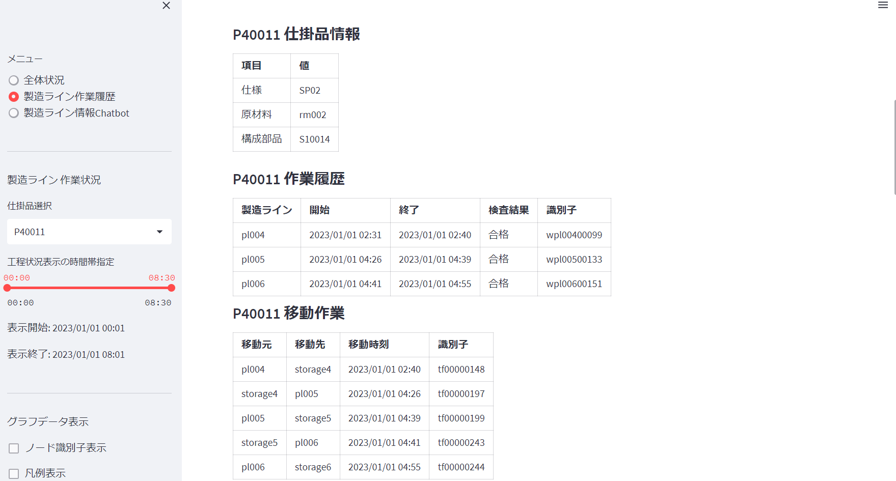
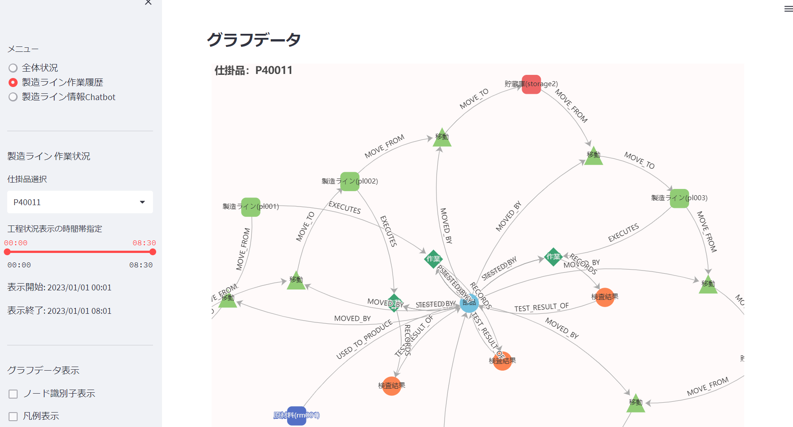

## グラフデータベースSurrealDBによる仮想製造ラインのトレーサビリティシステムの試作  

## １．目的

グラフデータベース機能を持つSurrealDBを使用して、仮想製造ラインのトレーサビリティ実現システムを実装し、グラフデータベースを使用することの利点を説明することを目的としています。  

具体的には、以下のような課題を解決することを目指します。

1. 製造ライン上で発生する各種データを収集し、グラフデータベースに蓄積することで、製造工程や製品の履歴を可視化する。  

1. 可視化された製造工程や製品の履歴を利用して、不具合が発生した場合に、原因の特定や問題解決を迅速に行うことができるようにする。  

1. 製品の品質向上や、製造プロセスの改善に役立てることができるようにする。  

グラフデータベース利用分野は、ソシャルネットワーク分析、推薦システム、ナレッジマネージメントといった事例が多いです.  
この記事では、製造ライン(工場)でのグラフデータベースの利用方法を説明しています.  
グラフデータベースの特徴を活用したトレーサビリティ実現システムの構築の例を紹介します。  
  
#### トレーサビリティとは  

> トレーサビリティとは、｢その製品がいつ、どこで、だれによって作られたのか｣を明らかにすべく、原材料の調達から生産、
> そして消費または廃棄まで追跡可能な状態にすることです。  
> 近年では製品の品質向上に加え、安全意識の高まりから重要度が増しており、自動車や電子部品をはじめ、
> 食品や医薬品など幅広い分野に浸透しています。  
「トレーサビリティ大学」から引用: https://www.keyence.co.jp/ss/products/marker/traceability/basic_about.jsp  

---  

## ２．SurrealDBとは

この記事ではSurrealDBについて詳細には説明していません.  
詳細な情報は、以下のサイトや記事を参考にしてください.  

* [SurrealDB is the ultimate cloud database for tomorrow's applications](https://surrealdb.com/)  
* [SurrealDB wants to be the future of SQL](https://medium.com/@darkghosthunter/surrealdb-wants-to-be-the-future-of-sql-297a4f92539f)  
* [SurrealDB Internal design — Part 1 — Welcome to Wonderland](https://medium.com/@ori-cohen/surrealdb-internal-design-part-1-welcome-to-wonderland-4444242353e6)  
* [SurrealDB Internal design — Part 2 — Architecture](https://medium.com/@ori-cohen/surrealdb-internal-design-part-2-architecture-1d816dfd62ee)  
* [SurrealDB Internal design — Part 3— Into the Rabbit Hole with SurrealQL](https://medium.com/@ori-cohen/surrealdb-internal-design-part-3-into-the-rabbit-hole-with-surrealql-c5dc9ef3e119)  
* [SurrealDB’s Sophisticated Storage Solution — SurrealDB Internals Part 4](https://ori-cohen.medium.com/surrealdbs-sophisticated-storage-solution-surrealdb-internals-part-4-29b3ea20e110)  

注目するSurrealDBの特徴は以下です.  

1. グラフデータ、ドキュメント(NoSQL)、リレーショナルデータの３種類のデータが扱える  
1. 全てのデータをSQLライクなSurrealQL問合せ言語で統一的に扱える  
1. in-memory データベースとして動作する  

---  

## ３．取り組みかた  

以下の手順で実施しました.  

1. 製造ライン(工場))のシミュレーションモデルを設計し、製造ラインから収集するデータを決める.
1. 製造情報のグラフデータモデルを設計する
1. 製造ラインのシミュレータを実行し製造ラインからのデータをJSONファイルへ出力する
1. 生成された製造情報(json)をグラフデータとしてSurrealDBへ格納する.
1. SurrealDBを使用して製造ライン情報ダッシュボードを作り、トレーサビリティ機能を評価する.

開発したプログラムは以下です.使用言語はpythonです.  

|名前|説明|使用した主な技術|  
|:-|:-|:-|  
|製造ライン シミュレータ|製造ラインのシミュレーション実行と製造情報出力|simpy|  
|データインポータ|シミュレータから出力されたデータをSurrealDBへ格納する|SurrealDB|  
|ダッシュボード1|製造ライン実績表示|streamlit, SurrealDB|
|ダッシュボード2|製造ライン トレサービリティ表示|streamlit, SurrealDB,matplotlib,apache echarts|  
|ダッシュボード3|日本語による製造状況問合せチャット|streamlit, SurrealDB, openai(GTP-4),langchain|  
  
---  

## ４．ソースコード  

ここで使用した全てのソースコードは、以下のgithub リポジトリへ格納しています.  

[https://github.com/tmarumaru/SurrealDB-FactoryDemo](https://github.com/tmarumaru/SurrealDB-FactoryDemo)  

---  

## ５．製造ラインの設計  

ディスクリート製造ラインの非常に単純な工場モデルです.  
仕掛品(部品・製品)は製造ラインで個別識別できるようにRFID/QRコード等で固有の識別子が付いている想定です.  
この製造ラインでは、作業者が付属する機器を操作して仕掛品を加工する半自動の製造ラインを想定しています.  
製造ライン処理系統は以下の２つが存在します.  

* 系統１：部品を作る(製造ライン１、製造ライン２、製造ライン３）  
* 系統２：系統１で作った部品を仕掛品へ組込み製品を完成する(製造ライン４、製造ライン５、製造ライン６)

各製造ラインでは検査が実施され、検査結果が記録されます.  仕掛品に欠陥が見つかった場合、欠陥情報が記録されます.  
各製造ラインでの加工が完了すると、仕掛品は貯蔵庫へ移動されます.  欠陥のある仕掛品は、特別な貯蔵庫(修理品倉庫)へ移動されます.  
完成した部品は、貯蔵庫３へ格納されます.完成した製品は製品倉庫(貯蔵庫6)へ格納され出荷を待ちます.  


### 製造情報の設計 

各製造ラインからは、以下の情報がメッセージとして出力されます. 現実のシステムでは、これらの情報はデータレイク等へリアルタイムに格納されることになります.  
ここでは、データレイクに格納された製造情報を二次的に利用する想定です.  
現実の製造ラインからは種々のデータ形式の情報が収集されデータの正規化等の処理が必要ですが、ここでは正規化されたメッセージとしてを扱います.  

  |種別|説明|メッセージ作成元|メッセージ作成タイミング|  
  |:-|:-|:-|:-|  
  |作業情報|作業開始|各製造ライン|製造ラインが仕掛品に対して作業を開始した時|    
  |〃|作業終了|各製造ライン|製造ラインが仕掛品に対して作業を終了した時|    
  |仕掛品情報|仕掛品を生成|各製造ライン|仕掛品を生成した時|    
  |〃|部品を仕掛品へ組込み|各製造ライン|部品を仕掛品へ組込んだ時|    
  |〃|検査結果|各製造ライン|検査完了時|    
  |〃|欠陥情報|各製造ライン|検査で欠陥検知した時|    
  |移動情報|仕掛品,部品,製品の移動情報|各製造ライン|貯蔵庫から製造ラインへ仕掛品を移動した時<BR>製造ラインから貯蔵庫へ仕掛品を移動した時|  
  |測定値|機器の測定値・ログなど|製造ラインの機器|定期：測定値／不定期：ログ等|  

---  

## ６．グラフデータモデルの設計  

### 製造ラインのグラフデータモデルの設計手順  

* 対象となるエンティティの洗い出し  

    製品、部品、製造ライン、機器、作業者、仕様書、工程などのエンティティを洗い出します。
    これらのエンティティの属性や関係性についても考えます。

* エンティティとエンティティの関係性の洗い出し

    エンティティ間の関係性を洗い出し、グラフ上での接続方法を決定します。
    例えば、製品は部品から構成される、製造ラインは複数の機器から構成される、作業者は製造ラインに所属するなどの関係性を考えます。

* ノード・エッジの属性の洗い出し

    各ノードとエッジの属性を洗い出します。
    例えば、製品には製品名、製品番号、製造年月日などの属性があり、製品と部品の関係には数量などの属性があります。

* モデルの実装

    洗い出したエンティティ、属性、関係性を元に、グラフデータベースにモデルを実装します。

* クエリの設計

    グラフデータベースに対するクエリを設計します。
    クエリは、製品のトレーサビリティの検索や、部品の在庫状況の確認など、製造現場で必要とされる情報に基づいて設計します。


### 設計したグラフデータモデル  

グラフデータモデルの関係には大きく２つの関係を設計しました.  

* 仕掛品の加工作業に関するもの  
* 仕掛品の移動作業に関するもの  


* グラフノード  

    |グラフノード|説明|テーブル名|備考|  
    |:-|:-|:-|:-|  
    |工場|製品生産場所|FACTORY||  
    |製品仕様|製品仕様情報|SPECIFICATION||  
    |製造ライン|作業工程毎の生産ライン|PRODUCTION_LINE||    
    |機器|生産ラインで使用する機器・センサー等|MACHINE||  
    |貯蔵庫|製品を保管する場所|STORAGE|||  
    |製品|製造した物|PRODUCT||仕掛品、欠陥品を含む|  
    |製品仕様|製品の仕様情報|SPECIFICATION|||  
    |作業|製造ライン実施された作業情報|WORK||  
    |原材料|仕掛品を製造する原材料|RAW_MATERIAL||  
    |検査結果|検査作業の結果情報|INSPECTION_RESULT||  
    |欠陥情報|検出された欠陥情報|DEFECT_INFORMATION||  
    |作業班|製造ライン毎に割当てられる作業班|OPERATING_CREW||  
    |機器情報|機器・センサーからのログ|MEASUREMENTS||  
  
* 関係(Relationship)

    |関係|意味|補足|  
    |:-|:-|:-|  
    |A->CONSISTS_OF->B|AはBを構成要素として持つ||  
    |A->EXECUTES->B|A(製造ライン)はB(作業)を実行する||  
    |A->STATRED_BY->B|A(製品)へB(作業)を開始する||  
    |A->ENDED_BY->B|A(製品)へのB(作業)を終了する||  
    |A->RECORDS->B|AはBを記録する||  
    |A->USED_TO_PRODUCE->B|A(原材料)でB(仕掛品・部品・製品)が生成される||  
    |A->COMPRISED_OF->B|A(製品)はB(部品)を持つ||  
    |A->HAS_DEFECT->B|A(製品)はB(欠陥情報)を持つ||  
    |A->DEFECT_DETECTED_BY->B|A(製品)はB(作業)で欠陥が検知された||  
    |A<-TEST_RESULT_OF<-B|AはB(製品)の検査情報である||  
    |A->MOVE_FROM->B|移動作業BがAから仕掛品を移動する||  
    |A->MOVE_TO->B|移動作業AがBへ仕掛品を移動する||  
    |A->MOVED_BY->B|仕掛品Aが移動作業Bによって移動される||  
    |A->HAS_WORKERS->B|A(製造ライン)はB(作業班)を持つ||  
  
---  

## ７．工場のシミュレーション
  
SimPyを使用して、工場の要素である製造ライン、貯蔵庫をシミュレートするプロセスを準備し、シミュレーションを実行します.  
シミュレーション時間は、simulatorの起動引数で指定できます.  
引数省略時のシミュレーション時間は500分(約8.3時間)となります.  
  
* 工場の構成要素
  
  |構成要素|説明|存在|備考|  
  |:-|:-|:-|:-| 
  |工場|製品生産場所|1||  
  |製造ライン|作業工程毎の生産ライン|６|工場に紐づく|    
  |仕掛品<BR>部品<BR>製品<BR>欠陥品|仕掛品は製造中の物<BR>部品および製品は最終検査で合格した物<BR>欠陥品は欠陥が検知された仕掛品|複数|製造ラインの生産量に依存する|  
  |機器|生産ラインで使用する機器・センサー等|１２|製造ラインに紐づく|  
  |貯蔵庫|仕掛品・製品を保管する場所|７|製造ラインに紐づく|  
  |作業班|製造ライン毎に割当てられる作業班|６|製造ラインに紐づく|  
  |原材料|仕掛品を製造する原材料|４|工場に紐づく|  
  |製品仕様|製造する製品仕様|２|工場に紐づく|  
  
* シミュレーション・プロセス
  
  本シミュレータは以下のプロセスをSimPyのプロセスとして実行します.  

  |プロセス|説明|クラス名|  
  |:-|:-|:-|  
  |製造ライン１|部品仕掛品生成工程|WipCreationProcess|  
  |製造ライン２|部品中間工程|IntermediateProcess|  
  |製造ライン３|部品検査工程|InspectionProcess|  
  |製造ライン４|製品仕掛品生成工程|WipCreationProcess|  
  |製造ライン５|製品中間工程|IntermediateProcess|  
  |製造ライン６|製品検査工程|InspectionProcess|  
  |貯蔵庫１|貯蔵庫資源１|StorageResource|  
  |貯蔵庫２|貯蔵庫資源２|StorageResource|  
  |貯蔵庫３|貯蔵庫資源３|StorageResource|  
  |貯蔵庫４|貯蔵庫資源４|StorageResource|  
  |貯蔵庫５|貯蔵庫資源５|StorageResource|  
  |製品倉庫|貯蔵庫資源６|StorageResource|  
  |修理貯蔵庫|貯蔵庫資源７|StorageResource|  
  |機器0000|製造ライン１の機器１|MachineProcess|  
  |機器0001|製造ライン１の機器２|MachineProcess|  
  |機器0100|製造ライン２の機器１|MachineProcess|  
  |機器0101|製造ライン２の機器２|MachineProcess|  
  |機器0200|製造ライン３の機器１|MachineProcess|  
  |機器0201|製造ライン３の機器２|MachineProcess|  
  |機器0300|製造ライン４の機器１|MachineProcess|  
  |機器0301|製造ライン４の機器２|MachineProcess|  
  |機器0400|製造ライン５の機器１|MachineProcess|  
  |機器0401|製造ライン５の機器２|MachineProcess|  
  |機器0500|製造ライン６の機器１|MachineProcess|  
  |機器0501|製造ライン６の機器２|MachineProcess|  
  
* 製造イベント情報  
  
  製造イベント情報は、以下のメッセージが各製造ラインから送られてくる想定です.  
  このシミュレーション・システムでは、各シミュレーション・プロセスで発生したメッセージを各プロセスが一旦保持します.  
  シミュレーションが完了したら、これらの保持されたメッセージをJSONデータとしてファイルへ出力します.  
  
  |種別|説明|メッセージ作成元|メッセージ作成タイミング|  
  |:-|:-|:-|:-|  
  |作業情報|作業開始|各製造ラインプロセス|製造ラインが仕掛品に対して作業を開始した時|    
  |〃|作業終了|各製造ラインプロセス|製造ラインが仕掛品に対して作業を終了した時|    
  |仕掛品情報|仕掛品を生成|各製造ラインプロセス|仕掛品を生成した時|    
  |〃|部品を仕掛品へ組込み|各製造ラインプロセス|部品を仕掛品へ組込んだ時|    
  |〃|検査結果情報|各製造ラインプロセス|検査完了した時|    
  |〃|欠陥情報|各製造ラインプロセス|検査で欠陥検知した時|    
  |移動情報|仕掛品,部品,製品の移動情報|各製造ラインプロセス|貯蔵庫から製造ラインへ仕掛品を移動した時<BR>製造ラインから貯蔵庫(倉庫)へ仕掛品を移動した時|  
  |測定値|機器の測定値・ログなど|各機器プロセス|定期：測定値／不定期：ログ等|   


### シミュレーション実行結果
  
製造ライン シミュレータからは以下の形式のjsonファイルが出力されます.  
production_line,storages,machines,opterating_crew,productは、構成情報(識別子、機器情報等)が格納されます.  
これらからは、対応するグラフノードが生成されます.  
production_hostoriesは製造ライン毎に製造情報がメッセージとして格納されます.  
このメッセージを解釈して、作業ノードと、各ノード間の関係を生成します.  
※measurementsは機器からの測定情報が格納されますが、今回は使用していません.  
  
### JSONファイル構造  

  ``` json
  {
    "factory": {
      "id": "f01",
      "name": "factory#1",
      "production_lines": [],
      "storages": [],
      "machines": [],
      "operating_crews": [],
      "raw_materials": [],
      "products": [],
      "production_histories": [
          {
              "created_by": "PRODUCTION_LINE:pl001",
              "messages": [],
          },
      ],
      "measurements": [
        {
          "created_by": "MACHINE:m0000",
          "messages": [],
        }
      ]
    }
  }
  ```
  
* JSONデータ項目定義

    |項目|意味|補足|  
    |:-|:-|:-|  
    |factory.id|工場識別子|省略不可|  
    |factory.name|工場名|省略不可|  
    |factory.production_lines|製造ライン情報|省略不可|  
    |factory.storages|貯蔵庫情報|省略不可|  
    |factory.maches|各製造ラインの機器情報|省略不可|  
    |factory.operating_crews|作業班情報|省略不可|  
    |factory.products|製品情報|省略不可<BR>工場で製造した全製品(仕掛品)情報|  
    |factory.production_histories|作業履歴情報|省略不可<BR>全製造ラインで実行した作業履歴情報|  
    |factory.measurements|機器ログ情報|省略不可<BR>全機器情報のログ情報|  

### 製造ライン情報(factory.production_lines)

* 製造ライン情報の定義  

  製造ライン情報は以下の形式で格納されています.  

  ``` json
   "production_lines": [
      {
        "id": "pl001",
        "data": {
          "name": "製造ライン1",
          "process_id": "SP01-1",
          "machines": [
            "MACHINE:m0000",
            "MACHINE:m0001"
          ],
          "working_group_id": "OPERATING_CREW:g0000"
        }
      },
  ]
  ```
  
* 製造ライン情報項目  

    |項目|意味|補足|  
    |:-|:-|:-|  
    |id|製造ライン識別子|省略不可|  
    |data.name|製造ライン名|省略不可|  
    |data.process_id|製造工程識別子<BR>該当製造ラインで実行する作業指示書の識別子|省略不可|  
    |data.machines|製造ラインの機器識別子<BR>該当製造ラインで使用する製造機器の識別子リスト |省略不可|  
    |data.working_group_id|作業班識別子|省略不可|  
  
### 貯蔵庫情報(factory.straoges)  
  
* 貯蔵庫情報の定義  

  貯蔵庫情報は以下の形式で格納されます.  
  
  ``` json
  "storages": [
    {
      "id": "storage1",
      "data": {
        "name": "貯蔵庫1"
      }
    },
  ]
  ```

* 貯蔵庫情報項目  

    |項目|意味|補足|  
    |:-|:-|:-|  
    |id|貯蔵庫識別子|省略不可|  
    |data.name|貯蔵庫名|省略不可|  
  
### 機器情報(factory.machines)
  
* 機器情報の定義  

  機器情報は以下の形式で格納されます.  
  
  ``` json
  "machines": [
    {
      "id": "m0000",
      "data": {
        "name": "機器0000"
      }
    },
  ]
  ```
  
* 機器情報項目  

    |項目|意味|補足|  
    |:-|:-|:-|  
    |id|機器識別子|省略不可|  
    |data.name|機器名|省略不可|  
  
### 作業班情報(factory.operating_crews)

* 作業班情報の定義  

  作業班情報は以下の形式で格納されます.  
  
  ``` json
  "operating_crews": [
    {
      "id": "g0000",
      "data": {
        "name": "作業班-0000"
      }
    },
  ]
  ```
  
* 作業班情報項目  

    |項目|意味|補足|  
    |:-|:-|:-|  
    |id|作業班識別子|省略不可|  
    |data.name|作業班名|省略不可|  
  
### 原材料情報(factory.raw_materials)

* 原材料情報の定義  

  原材料情報は以下の形式で格納されます.  
  
  ``` json
  "raw_materials": [
    {
      "id": "rm000",
      "data": {
        "name": "原材料-000"
      }
    },
  ]
  ```
  
* 原材料情報項目  

    |項目|意味|補足|  
    |:-|:-|:-|  
    |id|原材料識別子|省略不可|  
    |data.name|原材料名|省略不可|  
  
### 製品情報(factory.products)

* 製品情報の定義  

  製品情報は以下の形式で格納されます.  
  
  ``` json
  "products": [
    {
      "id": "S10001",
      "data": {
        "name": "Product for SP01",
        "type": "PARTS",
        "status": "FINISHED_PRODUCT",
        "specification": "SP01"
      }
    },
  ]
  ```
  
* 製品情報項目  

    |項目|意味|補足|  
    |:-|:-|:-|  
    |id|製品識別子|省略不可|  
    |data.name|製品名|省略不可|  
    |data.type|製品種別|省略不可<BR>PRODUCT:製品<BR>PARTS:部品|  
    |data.status|製品状態|省略不可<BR>WORK_IN_PROGRESS:仕掛品<BR>FINISHED_PRODUCT:製品<BR>DEFECT_DETECTION:欠陥品<BR>REPAIR:修理中<BR>SPOILAGE:廃棄|  
    |data.specification|製品仕様|省略不可|  

### 作業履歴情報(factory.production_histories)

* 作業履歴情報の定義  

  作業履歴情報は以下の形式で格納されます.  
  
  ``` json
  "production_histories": [
    {
      "created_by": "PRODUCTION_LINE:pl001",
      "messages": [],
    },
  ]
  ```

* 作業履歴情報項目  

    |項目|意味|補足|  
    |:-|:-|:-|  
    |created_by|作業を実行した製造ライン識別子|省略不可|  
    |messages|製造ラインからの作業メッセージ|省略不可|  

### メッセージ情報(factory.production_histories[].messages)  

* 製造情報(message)の定義

  メッセージ情報は以下の形式で格納されています.  

  ``` json
  "messages": [
    {
      "id": "m00000639",
      "work_id": "wpl00500123",
      "message_type": "PROCESS",
      "timestamp": "2023-01-01T02:15:00+00:00",
      "data": {
          "work_type": "INSPECTION",
          "product_id": "PRODUCT:P40003",
          "product_type": "PRODUCT",
          "product_status": "WORK_IN_PROGRESS",
          "inspection_result": { "result": "OK" },
          "product_defect": {},
          "raw_material_id": "",
          "parts_id": "",
          "storage_id": ""
      }
    },
  ]
  ```
  
* メッセージ項目  

    |項目|意味|補足|  
    |:-|:-|:-|  
    |id|メッセージ識別子|文字列|省略不可|  
    |work_id|作業識別子|省略不可|  
    |created_by|メッセージ作成元識別子|省略不可|  
    |messsage_type|メッセージ型|"PROCESS"固定|  
    |timestamp|timestamp|メッセージの事象が発生した日時|UTC時間形式|  
    |data.work_type|製造ラインの処理種別|省略不可|  
    |data.product_id|仕掛品・半製品・製品識別子|省略不可|  
    |data.product_type|仕掛品・半製品・製品識別子|省略不可|  
    |data.product_status|仕掛品・半製品・製品の状態|省略可|  
    |data.inspection_result|検査結果|省略可|  
    |data.raw_material_id|原材料識別子|省略可|  
    |data.parts_id|半製品識別子|省略可|  
    |data.product_defect|検出した欠陥の情報|省略可|  
  
* 製造ラインの処理種別(work_type)

    |値|説明|メッセージ作成タイミング|  
    |:-|:-|:-|  
    |OPERATION_START|作業開始|製造ラインが作業を開始した時|  
    |OPERATION_END|作業終了|製造ラインが作業を完了した時|  
    |CREATED|仕掛品生成|製造ラインが仕掛品を生成した時|  
    |ASSEMBLY|部品組込み|製造ラインが仕掛品へ部品を組込んだ時|  
    |INSPECTION|検査実施|製造ラインが仕掛品の検査を終了時|  
    |DEFECT_DETECTION|欠陥検出|各工程での確認で欠陥検知時|  
    |PUT_IN|仕掛品移動|貯蔵庫から製造ラインへ仕掛品を移動した時|  
    |PUT_OUT|仕掛品移動|製造ラインから貯蔵庫へ仕掛品を移動した時|  
  
* 製造ラインの処理種別から生成する関係(Relationship)
  
    |値|説明|生成する関係|  
    |:-|:-|:-|  
    |OPERATION_START|作業開始|PRODUCTION_LINE->EXECUTES->WORK<BR>PRODUCT->STARTED_BY->WORK|  
    |OPERATION_END|作業終了|PRODUCT->ENDED_BY->WORK|  
    |CREATED|仕掛品生成|RAW_MATERIAL->USED_TO_PRODUCE->PRODUCT|  
    |ASSEMBLY|部品組込み|PRODUCT->COMPRISED_OF->PRODUCT|  
    |INSPECTION|検査実施|WORK->RECORDS->INSPECTION_RESULT<BR>INSPECTION_RESULT->TEST_RESULT_OF->PRODUCT|  
    |DEFECT_DETECTION|欠陥検出|WORK->RECORDS->DEFECT_INFORMATION<BR>DEFECT_INFORMATION<-HAS_DEFECT<-PRODUCT<BR>WORK<-DEFECT_DETECTED_BY<-PRODUCT|  
    |PUT_IN|仕掛品移動|STORAGE->MOVE_FROM->WORK<BR>WORK->MOVE_TO->PRODUCTION_LINE<BR>WORK<-MOVED_BY<-PRODUCT|  
    |PUT_OUT|仕掛品移動|PRODUCTION_LINE->MOVE_FROM->WORK<BR>WORK->MOVE_TO->STORAGE<BR>WORK<-MOVED_BY<-PRODUCT|  


---  

## ８．グラフデータの生成  

### ノードの登録  

ノードの登録は、登録するテーブルとノードの識別子をCREATE文で指定することで簡単に登録できます.  
ノードに任意の情報を格納することができます. CREATE文のCONTENT句へkey/value形式でデータを指定できます.  
  
* ノード生成 SurrealQL  

  ``` sql
  # 工場ノード
  CREATE FACTORY:識別子 CONTENT { "data": { "name": 工場名 }};
  
  # 製品仕様ノード
  CREATE SPECIFICATION:識別子 CONTENT { "data": {"name": 製品仕様名 }}; 

  # 製造ラインノード
  CREATE PRODUCTION_LINE:識別子 CONTENT {
    "data": {
      "name": 製造ライン名,
      "process_id": 工程識別子, 
      "machines": 機器情報, 
      "working_group_id": 作業班情報 
    }
  }; 

  # 機器ノード
  CREATE MACHINE:識別子 CONTENT { "data": { "name": 機器名 }};

  # 貯蔵庫ノード
  CREATE STORAGE:識別子 CONTENT { "data": { "name": 貯蔵庫名 }};
  
  # 製品ノード
  CREATE PRODUCT:識別子 CONTENT {
    "data" { 
      "name": 製品名, 
      "type": 製品種別, 
      "status": 状態, 
      "specification": 製品仕様 
    }};
  
  # 製品仕様ノード  
  CREATE SPECIFICATION:識別子 CONTENT {
    "data" { 
      "name": 製品仕様名 
      "specification": 製品仕様 
    }};

  # 通常作業ノード
  CREATE WORK:識別子 CONTENT {
    "data": {
      "created_by": "PRODUCTION_LINE:pl002",
      "name": "work",
      "type": "NormalWork"
    }};

  # 移動作業ノード  
  CREATE WORK:識別子 CONTENT {
    "data": {
      "created_by": "PRODUCTION_LINE:pl001",
      "name": "transfer work",
      "type": "TransferWork"
    }}; 

  # 原材料
  CREATE RAW_MATERIAL:識別子 CONTENT { "data": { "name": "原材料-000" }}; 
  
  # 検査結果ノード
  CREATE INSPECTION_RESULT:識別子 CONTENT {
    "data": {
      "detail": {
        "result": "OK"
      },
      "name": "Inspection result"
    }}, 

  # 欠陥情報ノード
  CREATE DEFECT_INFORMATION:識別子 CONTENT {
    "data": {
      "detail": {
        "defect_code": 99,
        "location": {
          "x": 4,
          "y": 4
        }
      }
      "name": "Defect information"
    }};

  # 作業班ノード
  CREATE OPERATING_CREW:識別子 CONTENT { "data": { "name": "作業班-0000" }};
  
  # 機器ログ情報ノード
  CREATE MEASUREMENTS:識別子 CONTENT { 
    "message_type": "MEASUREMENT",
    "timestamp": "2023-01-01T00:02:00Z",
    "data": {
      "measurements": {
        "value": 1
      }
    }};  
  ```

### ノード間の関係登録  

ノード間の関係の登録は、２つのノード間の関係をRETATE文で指定することで簡単に登録できます.  
関係に任意の情報を格納することができます. RELATE文のCONTENT句へkey/value形式でデータを指定できます.  
  
* 関係生成 SurrealQL  

  ``` sql
  # 工場と製造ラインの関係
  RELATE FACTORY:識別子->CONSISTS_OF->PRODUCTION_LINE:識別子 CONTENT { "data": "timestamp": 設置日時 };

  # 工場と貯蔵庫の関係
  RELATE FACTORY:識別子->CONSISTS_OF->STORAGE:識別子 CONTENT { "data": "timestamp": 設置日時 };

  # 工場と原材料の関係
  RELATE FACTORY:識別子->CONSISTS_OF->RAW_MATERIAL:識別子 CONTENT { "data": "timestamp": 原材料入庫日時 };

  # 製造ラインと機器の関係
  RELATE PRODUCTION_LINE:識別子->CONSISTS_OF->MACHINE:識別子 CONTENT { "data": "timestamp": 設置日時 };
  
  # 製造ラインと作業班の関係
  RELATE PRODUCTION_LINE:識別子->HAS_WORKERS->OPERATING_CREW:識別子 CONTENT { "data": "timestamp": 作業実行日時 };
  
  # 製造ラインで実行した作業の関係
  RELATE PRODUCTION_LINE:識別子->EXECUTES->WORK:識別子 CONTENT { "data": "timestamp": 作業割当時刻 };

  # 製品生成と作業の関係
  RELATE PRODUCT:識別子->PRODUCED_BY->WORK:識別子 CONTENT { "data": "timestamp": 製品生成日時 };

  # 製品と原材料の関係
  RELATE RAW_MATERIAL:識別子->USED_TO_PRODUCE->PRODUCT:識別子 CONTENT { "data": "timestamp": 原材料取込み日時 };

  # 製品と部品の関係
  RELATE PRODUCT:識別子->COMPRISED_OF->PRODUCT:識別子 CONTENT { "data": "timestamp": 部品組込み日時 };

  # 製品と作業開始の関係
  RELATE PRODUCT:識別子->STARTED_BY->WORK:識別子 CONTENT { "data": "timestamp": 作業開始日時 };

  # 製品と作業終了の関係
  RELATE PRODUCT:識別子->ENDED_BY->WORK:識別子 CONTENT { "data": "timestamp": 作業終了日時 };

  # 製品と組立作業の関係
  RELATE PRODUCT:識別子->ASSEMBLED_BY->WORK:識別子 CONTENT { "data": "timestamp": 組立作業実行日時 };

  # 製品と検査作業の関係
  RELATE PRODUCT:識別子->TESTED_BY->WORK:識別子 CONTENT { "data": "timestamp": 検査完了日時 };

  # 製品と検査結果情報の関係
  RELATE INSPECTION_RESULT:識別子->TEST_RESULT_OF->PRODUCT:識別子 CONTENT { "data": "timestamp": 検査完了日時 };

  # 製品と検出した作業の関係
  RELATE PRODUCT:識別子->DEFECT_DETECTED_BY->WORK:識別子 CONTENT { "data": "timestamp": 欠陥検知日時 };

  # 製品と検出した欠陥情報の関係
  RELATE PRODUCT:識別子->HAS_DEFECT->DEFECT_INFORMATION:識別子 CONTENT { "data": "timestamp": 欠陥検知日時 };

  # 作業と検査結果情報の関係
  RELATE WORK:識別子->RECORDS->INSPECTION_RESULT:識別子 CONTENT { "data": "timestamp": 検査作業完了日時 };

  # 作業と欠陥情報の関係
  RELATE WORK:識別子->RECORDS->DEFECT_INFORMATION:識別子 CONTENT { "data": "timestamp": 欠陥検知日時 };

  # 移動作業と移動先の関係
  RELATE WORK:識別子->MOVE_TO->PRODUCTION_LINE:識別子 CONTENT { "data": "timestamp": 製品移動完了日時 };
  RELATE WORK:識別子->MOVE_TO->STORAGE:識別子 CONTENT { "data": "timestamp": 製品移動完了日時 };

  # 移動作業と移動元の関係
  RELATE PRODUCTION_LINE:識別子->MOVE_FROM->WORK:識別子 CONTENT { "data": "timestamp": 製品移動完了日時 };
  RELATE STORAGE:識別子->MOVE_FROM->WORK:識別子 CONTENT { "data": "timestamp": 製品移動完了日時 };

  # 移動作業と製品の関係
  RELATE PRODUCT:識別子->MOVED_BY->WORK:識別子 CONTENT { "data": "timestamp": 製品移動完了日時 };
  ```
  
---  

## ９．ダッシュボード - 製造ライン実績表示  

製造ラインの実績を確認することができます.  
部品、製品の製造コストを知ることが重要です、この仮想製造ラインでは製造に費やした作業時間と欠陥品の数が主なコストになります.  
ダッシュボードには、以下の情報を表示します.  

### ダッシュボード画面  

* 製品毎・部品毎の製造実績、歩留り、総製造時間情報  

    

* 製造ライン毎の製造実績、歩留り情報  

    


### 各製造ラインの製造実績値の取得

各製造ライン毎に、入力された仕掛品数、出力された仕掛品数、欠陥が検知された仕掛品数を求める.  

各製造ラインノード(PRODUCTION_LINE)で実行した作業ノード(WORK)を求め、その作業ノードと以下の関係が張られている仕掛品ノード(PRODUCT)の数を求めています.  
製品毎、部品毎の集計は、各製造ライン毎の値をプログラムで合算して求めています.  
製造実績はmatolibの円グラフ(Axes.pie)で表示しています.  各メトリックは、streamlitのmetoricで表示しています.  

* WORK<-STARTED_BY<-PRODUCT         : 作業開始
* WORK<-ENDED_BY<-PRODUCT           : 作業終了
* WORK<-DEFECT_DETECTED_BY<-PRODUCT : 欠陥検出

``` sql
SELECT id AS production_line,
       count(->EXECUTES->WORK<-STARTED_BY<-PRODUCT) AS input_products_num,
       count(->EXECUTES->WORK<-ENDED_BY<-PRODUCT) AS output_products_num,
       count(->EXECUTES->WORK<-DEFECT_DETECTED_BY<-PRODUCT) AS defect_products_num 
FROM PRODUCTION_LINE;
```

* 検索結果
  
``` json
[
  {
    "input_products_num": 35,
    "output_products_num": 34,
    "defect_products__num": 6,
    "production_line": "PRODUCTION_LINE:pl001"
  },
]
```
|フィールド名|説明|補足|   
|:-|:-|:-|   
|production_line|製造ライン識別子||   
|input_products_num|製造ラインへ入力された仕掛品数||   
|output_products_num|製造ラインから出力された仕掛品数|合格品|   
|defect_products_num|製造ラインで検知された欠陥数|不合格品|   

* TODO  ソース修正が必要  'product_defect' ==>  'defect_products_num'


### 各製造ライン作業時間の取得

指定された製造ラインで実行された作業の開始・終了時刻を仕掛品毎に取得します.  
検索結果から実際の作業時間を求め、matplotlibの箱ひげ図(Axes.boxplot)とヒストグラム(Axes.hist)へ渡すことで、作業時間の分布を表示しています.  

``` sql
SELECT <-EXECUTES<-PRODUCTION_LINE.id AS production_line_id,
       <-STARTED_BY<-PRODUCT.id AS product_id,
       <-STARTED_BY.data.timestamp AS started_at,
       <-ENDED_BY.data.timestamp AS ended_at 
FROM WORK WHERE <-EXECUTES<-(PRODUCTION_LINE WHERE id = "PRODUCTION_LINE:pl001") 
             OR <-EXECUTES<-(PRODUCTION_LINE WHERE id = "PRODUCTION_LINE:pl003") 
SPLIT production_line_id, product_id, started_at, ended_at 
FETCH started_at, ended_at ; 
```
※ SPLITで指定されているフィールドは、確実に１つしか検索されないのでリストを分解しています.  
※ FETCHで指定されているフィールドは、timestamp属性を取得するためです.  

* 検索結果  

``` json
[
  {
    "production_line_id": "PRODUCTION_LINE:pl001",
    "product_id": "PRODUCT:S10001",
    "started_at": "2023-01-01T00:02:00Z",
    "ended_at": "2023-01-01T00:11:00Z",
  },
]
```

|フィールド名|説明|補足|  
|:-|:-|:-|  
|production_line_id|製造ライン識別子||  
|product_id|仕掛品識別子||  
|started_at|作業開始時刻||  
|ended_at|作業終了時刻||  

---  

## １０．ダッシュボード - トレーサビリティ 仕掛品(製品)の製造状況  

横軸を時間軸として、縦軸は製造ライントおよび貯蔵庫として、仕掛品毎の作業開始・終了時刻、仕掛品毎の移動時刻をグラフ描画しています.  

グラフの縦軸の 製造ライン:pl001～貯蔵庫:storage3 が SP1部品の製造工程(緑色の線)を表します.  
製造ライン:pl004～貯蔵庫:storage6 が、SP2製品の製造工程状況(青色の線)を表します.  
赤い表示は、欠陥が検出された工程を表し、貯蔵庫:repair1へ移動されますが、表示が煩雑になるため描画はしていません.  

時間軸は、サイドメニューで、表示開始時間、終了時間を指定することができます.  

* 全仕掛品 製造状況表示  
  

サイドメニューから仕掛品を選択すると、その仕掛品の製造状況が確認できます.  
選択した仕掛品が部品を組込んでいる場合、部品の製造状況もいっしょに表示されます.  


* "PRODUCT:P40014"仕掛品の製造状況表示  
  


### 仕掛品情報の取得

``` sql
SELECT *, 
       ->COMPRISED_OF->PRODUCT AS parts ,
        <-USED_TO_PRODUCE<-RAW_MATERIAL AS raw_materials 
FROM PRODUCT; 
```


### 全仕掛品の作業履歴の取得

各製造ラインで実行された全ての作業(WORK)を起点として、仕掛品毎に作業の開始・終了時刻、検査結果を取得します.  
取得した情報は、仕掛品毎にまとめてmatplotlib の図形として描画しています.  


``` sql
SELECT production_line,
       work_id AS work_id,
       product.id AS product,
       product.data.status AS product_status,
       function() {return this.started_by.length <= 0? null: this.started_by[0].data.timestamp;} as started,
       function() {return this.ended_by.length <= 0? null: this.ended_by[0].data.timestamp;} as ended ,
       time::unix(function() {return this.started_by.length <= 0? null : this.started_by[0].data.timestamp;}) as started_utime,
       time::unix(function() {return this.ended_by.length <= 0? null : this.ended_by[0].data.timestamp;}) as ended_utime, 
       function() {return this.result.length <= 0? null : this.result[0].data.detail.result;} AS inspection_result 
FROM (SELECT id AS work_id,
             <-EXECUTES<-PRODUCTION_LINE AS production_line,
             <-(STARTED_BY AS started_by)<-PRODUCT AS product,
             <-(ENDED_BY AS ended_by)<-PRODUCT,
             ->RECORDS->INSPECTION_RESULT AS result 
      FROM WORK WHERE <-EXECUTES<-PRODUCTION_LINE  
      SPLIT production_line, product 
      FETCH started_by, ended_by, product, result) 
ORDER BY production_line, started ;
```

* 検索結果

``` json
[
  {
    "production_line": "PRODUCTION_LINE:pl001",
    "work_id": "WORK:wpl00100001",
    "product": "PRODUCT:S10001",
    "product_status": "DEFECT_DETECTION",
    "started": "2023-01-01T00:02:00Z",
    "started_utime": 1672531320,
    "ended": "2023-01-01T00:11:00Z",
    "ended_utime": 1672531860,
    "inspection_result": "NG",
  },
]
```

|フィールド名|説明|補足|  
|:-|:-|:-|  
|production_line|製造ライン識別子||  
|work_id|作業識別子||  
|product|仕掛品識別子||  
|product_status|仕掛品状態||  
|started|作業開始時刻|UTC時刻文字列|  
|started_utime|作業開始時刻|Unix Time|  
|ended|作業終了時刻|UTC文字列/Null|  
|ended_utime|作業終了時刻|Unix Time/Null|  
|inspection_result|検査結果||  

---  

## １１．ダッシュボード - 仕掛品作業履歴・移動作業履歴

サイドメニューの「仕掛品選択」で選択した仕掛品（製品）の作業履歴、移動履歴の詳細が表示されます.  
  
* 仕掛品(製品) P4001 の作業履歴と移履歴の詳細です.  
  
  
  
* 仕掛品(製品) P4001 へ組込まれた部品 S10014 の作業履歴と移履歴の詳細です.  

  

---  

## １２．ダッシュボード - 製品と部品の作業関連グラフデータ表示

サイドメニューの「仕掛品選択」で選択した仕掛品（製品）の作業履歴、移動履歴のグラフデータが表示されます.  
選択された仕掛品(製品)から関係する全てのノードと関係を検索してグラフデータ表示します.  

* データグラフ画面  

  

検索は以下のget_relationships_of_node関数で行っています.  
この関数では、指定された仕掛品(製品)ノードから全ての関係で繋がるノードを再帰的に検索します.  
検索されたノードは_nodeに格納され、検索された関係は_relationships 格納されます.  
全ての検索されたノードが EXCLUSION_TABLE_NAMESで定義されたノードになるまで再帰的検索を継続します.  
  
任意のノードから任意の関係で繋がったノードの検索は以下のSurreaQLで行っています.  

* SurrealQL  
  
  ``` sql
  SELECT <->(? AS relationship)<->(?) AS node FROM 検索対象テーブル WHERE id=検索対象ノード識別子 
  FETCH relationship ;
  ```
  
* 検索処理 (helper.FactoryDBHelper)
  
  ``` python
  EXCLUSION_TABLE_NAMES = [
      FactoryNodeTable.FACTORY.name,
      FactoryNodeTable.PRODUCTION_LINE.name,
      FactoryNodeTable.STORAGE.name,
      FactoryNodeTable.MACHINE.name,
      FactoryNodeTable.OPERATING_CREW.name,
      FactoryNodeTable.SPECIFICATION.name,
      FactoryNodeTable.MANUFACTURER.name,
      FactoryNodeTable.RAW_MATERIAL.name,
  ]

  GET_RELATIONSHIPS_ABOUT_NODE = (
      'SELECT <->(? AS relationship)<->(?) AS node '
      'FROM {0} '
      'WHERE id="{1}" '
      'FETCH relationship ;'
  )

  async def get_relationships_of_node(
          self,
          node_id: str,
          relationships: [] = None,
          nodes: [] = None,
          traversed_nodes: [] = None,
  ) -> ([{}], [str], [str]):
      """
      指定されたノードに関連する「関係」と「ノード」を検索する
      :param node_id:          起点ノード
      :param relationships:    省略引数. 検索された関係.
      :param nodes:            省略引数. 検索されたノード群
      :param traversed_nodes:  省略引数. 検索起点となったノード群
      :return: (検索された関係群: [{}], 検索されたノード群: [str], 検索起点ノード群: [str])
      """
      _relationships = relationships if relationships else []
      _nodes = nodes if nodes else []
      _traversed_nodes = traversed_nodes if traversed_nodes else []
      _found_nodes = []
      while True:
          _table = node_id.split(':')[0]
          if _table in EXCLUSION_TABLE_NAMES:
              break
          if node_id in _traversed_nodes:
              break

          _traversed_nodes.append(node_id)
          if node_id not in _nodes:
              _nodes.append(node_id)

          _sql = GET_RELATIONSHIPS_ABOUT_NODE.format(_table, node_id)
          _response = await self.exec_sql(sql=_sql)
          if not _response or len(_response) <= 0:
              break
          for _r in _response[0].get('relationship', []):
              _rid = (_r.get('id', '?'))
              if not any(map(lambda x: x.get('id', '') == _rid, _relationships)):
                  _relationships.append(_r)
              else:
                  continue
              for _n in [_r.get('in', None), _r.get('out', None)]:
                  if not _n in _nodes:
                      _nodes.append(_n)
                      _found_nodes.append(_n)

          for _n in _found_nodes:
              if not _n.split(':')[0] in EXCLUSION_TABLE_NAMES and (not _n in _traversed_nodes):
                  _relationships, _nodes, _traversed_nodes = \
                      await self.get_relationships_of_node(
                          node_id=_n,
                          relationships=_relationships,
                          nodes=_nodes,
                          traversed_nodes=_traversed_nodes,
                      )
                  _traversed_nodes.append(_n)
      return _relationships, _nodes, _traversed_nodes
  ```
  
---  
  
## １３．ダッシュボード - 製造ライン情報チャトボット

### 必要性

蓄積された製造情報はグラフデータとして保存されますが、その情報を有効に利用して製造ラインの効率化や製品品質向上に活かすことが必要となります.  
製造担当者、管理者が自由にグラフデータを検索してその結果を実作業にできる環境が望まれます.  
  
入力データからグラフデータを生成することは、一旦グラフデータモデルが設計できれば非常に容易に行えます.  
しかし、グラフデータの検索を行う場合、グラフデータモデルに精通していても検索用SurrealQLを作ることは結構面倒な作業です.  
まして、一般の利用者が検索用SurrealQLを作ってグラフデータ検索することは不可能に近いです.  
自然な日本語の質問文から適切なSurrealQLを生成しデータベースを検索することができれば、グラフデータの利用を促進できます.  
その解決策として、Chatgpt-4を利用して日本語質問文からSurralDBの製造ライン情報を問合せするチャットボットを実装しています.  
このようなチャットボットを実現することで、現場の管理者・作業者が品質・製造上の問題などを探索的に確認できるようになります.  
  
### 使い方

「問合せ」フィールドへ日本語で問合せ文を入力して「問合せ実行」ボンタを押下と「チャット」へ回答を表示します.  
「問合せ」フィールドへ入力された文は OpenAI gpt-4 API を使用してSurrealQLへ変換されます.  
生成されたSurrealQLは「生成されたSurrealQL」フィールドへ表示されます.  
SurrealDBからの問合せ結果は OpenAI gtp-4 APIを使用して日本語へ変換され「チャット」フィールドへ表示されます.  

* 製造ライン情報チャットボット画面  

  
  
#### 問合せ例  

* 問合せ  

    ```  text
    欠陥情報を持つ製品ＩＤを取得しろ
    ```

* 生成されたSurrealQL

    ``` sql
    SELECT <-HAS_DEFECT<-PRODUCT.id AS product_id FROM DEFECT_INFORMATION SPLIT product_id ;
    ```

* 回答  

    ``` text
    欠陥情報を持つ製品IDは、PRODUCT:S10010、PRODUCT:S10025、PRODUCT:S10004、
                          PRODUCT:S10005、PRODUCT:S10015、PRODUCT:S10017、
                          PRODUCT:S10027、PRODUCT:S10031、PRODUCT:S10001、
                          PRODUCT:S10011、PRODUCT:S10021、PRODUCT:S10029、
                          PRODUCT:P40006、PRODUCT:P40009、PRODUCT:P40025、
                          PRODUCT:P40030、PRODUCT:P40001、PRODUCT:P40003です。
    ```

* 問合せ  

    ```  text
    製品ＩＤ＝PRODUCT:S10004の欠陥を検出した作業ＩＤと、作業開始時間、作業終了時間を取得しろ
    ```

* 生成されたSurrealQL

    ``` sql
    SELECT id AS work_id, 
           <-STARTED_BY.data.timestamp AS started_at, 
           <-ENDED_BY.data.timestamp AS ended_at 
    FROM WORK 
    WHERE <-STARTED_BY<-(PRODUCT WHERE id = 'PRODUCT:S10004') 
          AND ->RECORDS->DEFECT_INFORMATION<-HAS_DEFECT<-PRODUCT  
    SPLIT work_id FETCH started_at, ended_at ;
    ```

* 回答  

    ``` text
    作業ID：WORK:wpl00200039、作業開始時間：2023年1月1日 1時15分、作業終了時間：2023年1月1日 1時31分
    ```

* 問合せ  

    ```  text
    作業ＩＤ = "WORK:wpl00200039"が実行された製造ラインＩＤを取得しろ
    ```

* 生成されたSurrealQL

    ``` sql
    SELECT id AS production_line_id 
    FROM PRODUCTION_LINE 
    WHERE ->EXECUTES->(WORK WHERE id = 'WORK:wpl00200039') ;
    ```

* 回答  

    ``` text
    作業ID「WORK:wpl00200039」は製造ラインID「PRODUCTION_LINE:pl002」で実行されたものです。
    ```
  
### SurrealQL生成

日本語自然言語の問合せからSurrealQLを生成は以下のquery4関数で行っています.  
生成されたSurrealQLをSurrelDBで実行し検索結果と質問文を再度chatgptへ送り日本語の回答文を生成しています.  
SurrealQLの生成のためのプロンプト(CONVERT_NL_TO_SURREALQL_MESSAGES_jp)は日本語質問文と対応するSurreaQL文を約２０ケース指定しています.  
  
※使用している[プロンプト](./README_prompt.md)
  
* SurrealQL生成関数

  ``` python
  def query4(
        payload: Any,
        prompt_lang='日本語'
  ) -> Any:
      """
      OpenAI API GTP-4 による 日本語からSurrealQL生成
      :param payload: 入力データ
      :param prompt_lang: プロンプトの言語指定
      :return: GPTからの結果
      """

      messages = CONVERT_NL_TO_SURREALQL_MESSAGES_jp.copy()
      messages.append({
          "role": "user",
          "content": payload.get("inputs", {}).get("text", "?")
      })

      try:
          completions = openai.ChatCompletion.create(
              model="gpt-4",
              messages=messages,
              timeout=API_TIMEOUT,
          )
          sql = completions.choices[0].message.content
      except (APIConnectionError, AuthenticationError) as e:
          print(f'{e}')
          sql = ''

      return {
          'generated_text': sql,
      }
  ```

---  
  
## １４．まとめ
  
グラフデータモデルの設計は以下の手順で行うことで、実世界を反映したモデルを設計することができます.  
  
1. 物理的に存在する工場の製造ライン、貯蔵庫、仕掛品等をノードと定義する
1. 製造ラインで実行した作業をノードとして定義する
1. 作業ノードと物理的に存在するノードの間の関係を定義する
1. 各ノードで保持する情報を定義する
1. 各関係で保持する情報を定義する
  
グラフデータモデルが設計できれば、製造ラインで発生する各種データをSurrealDBへ保存することは非常に簡単です.  
ノードおよび関係の登録は軽い処理なので、製造現場で発生するデータを実時間で登録することも可能です.  
グラフデータモデルにはスキーマは存在しないので、製造ライン更新や新製品の製造等が発生した場合でも、既存情報を気にせず新しい情報を追加できます.  
また、後からノード間の関係を追加することもできるので、製造ライン情報の管理が非常に柔軟に行えます.  
  
製造工程や製品の作業履歴等の可視化のためのデータ検索は、RDBを使用した場合と同様に適切なクエリを作成することで実現可能です.  
設計情報、受注情報、発注情報、在庫情報、製品出荷情報、顧客情報等をグラフデータとして登録して関係付けすることで、製造ライン情報をより幅広く活用することが可能となります.  
  
品質トラブルや製造ライン作業の遅延等の原因分析にグラフデータの検索機能が利用でき、直感的には分からない隠れた要因を発見できる可能性があります.  
品質トラブルの原因分析はグラフデータを探索的に検索する必要があり、多くのクエリ(SurrealQL)を作成する必要があります.  
しかし、グラフデータベースのクエリを非専門家(管理者、作業者)が作成することは容易ではありません.  
そこで、生成系AI(Chatgpt-4)を利用して、自然言語(日本語)の問合文からクエリ(SurrealQL)を自動生成できるようにします.  
これにより、非専門家(管理者、作業者)が、柔軟に製造ライン情報を検索することが可能となります.  
  
### 成果
  
ダッシュボードの「製造ライン実績表示」では、製造ライン毎、製品毎の製造状況を可視化しています.  
ダッシュボードの「トレー仕掛品(製品)の製造状況」では、仕掛品(製品)毎の作業履歴を可視化しています.  
ダッシュボードの「製造ライン情報チャットボット」では、日本語文による製造ライン情報の問合せを実現しています.  

### SurrealDBの利点
  
グラフデータ、リレーショナルデータおよびドキュメント(NoSQL)が共存でき、グラフデータの検索結果を簡単にリレーショナルデータやドキュメントとして格納することができます.  
これにより定型的な情報はリレーショナルデータとして管理でき既存システム等とのデータ連携も可能となります.  
また、製造ライン機器からの多量なログ情報は、リレーショナルデータまたは、ドキュメントとして格納・管理することが可能となります.  
データの利用目的の応じて３種類のデータ形式が選択できることでシステムの柔軟性が増します.  
  
SurrealDBは以下の２種類の利用形態があります.  
データ量やデータの機密性等により利用形態が選択できます.  
また、組織単位のデータから必要データを移出して個人単位でデータ分析する形態も考えられます.  
  
* 個人単位のデータ分析

  ＰＣへSurrealDB(in-memory)導入して手元で手軽にデータ分析を行う  

* 組織単位のデータ管理

  分散環境での大規模グラフデータの管理とデータ分析を行う  
  
### 評価していない項目
  
* SurrealDBの性能
* SurrealDBのセキュリティ機能
* 分散環境でのSurrealDBの動作


